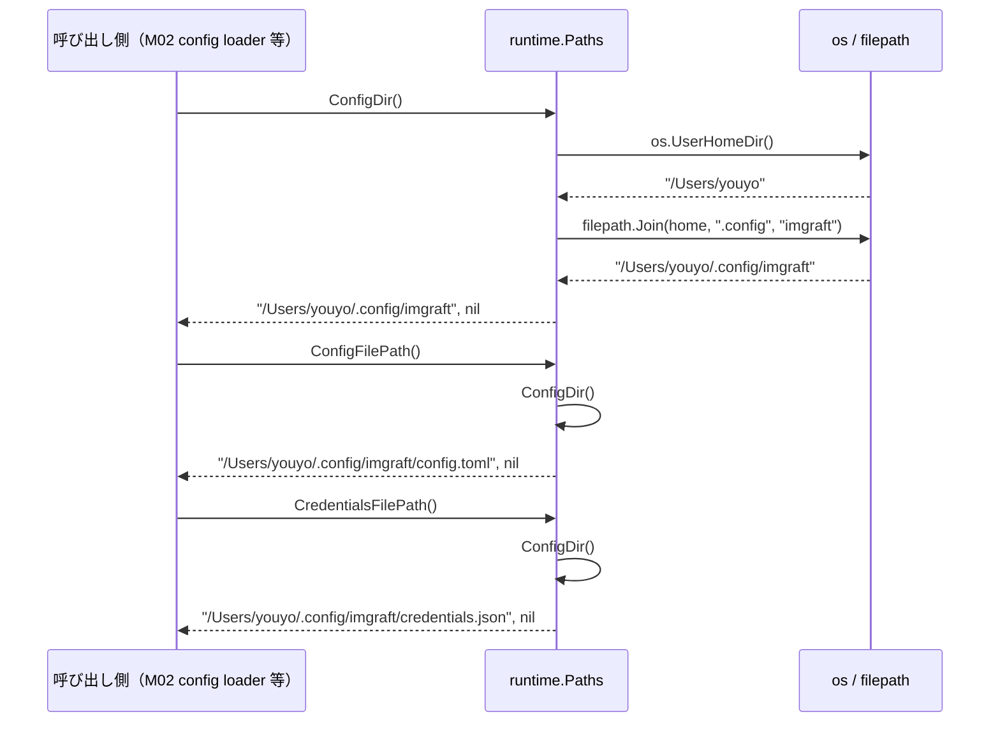
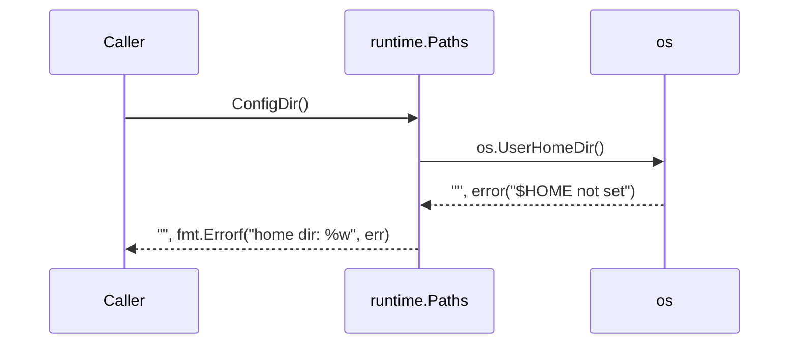
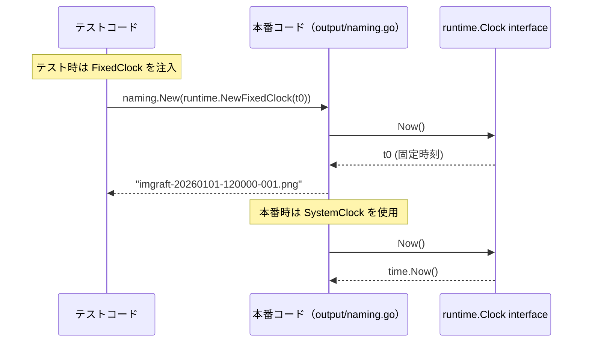
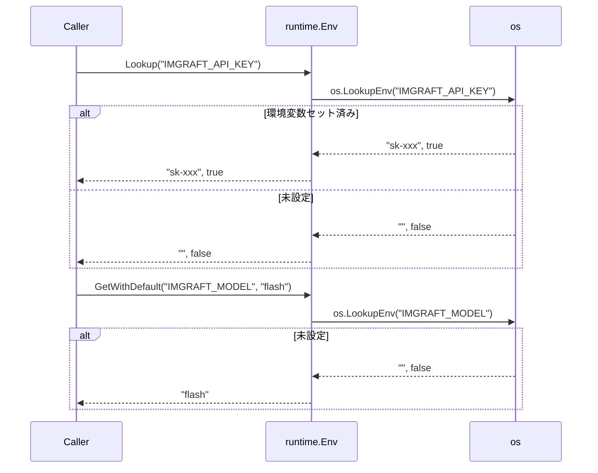

# M01: プロジェクト基盤・ランタイム

## Overview

| 項目 | 値 |
|------|---|
| ステータス | 未着手 |
| 依存 | なし（最初のマイルストーン） |
| 計画ファイル | `plans/imgraft-m01-project-foundation.md` |
| 対象ファイル | `go.mod`, `go.sum`, `internal/runtime/paths.go`, `internal/runtime/env.go`, `internal/runtime/clock.go`, `internal/runtime/paths_test.go`, `internal/runtime/env_test.go`, `internal/runtime/clock_test.go` |

---

## Goal

- `go.mod` を `github.com/youyo/imgraft` module として初期化し、kong / BurntSushi/toml / golang.org/x/image の 3 依存を追加する
- `internal/runtime` パッケージを実装し、後続マイルストーン（M02 config, M10 output naming）が共通利用できる基礎を提供する
- 設定ディレクトリパス解決・環境変数読取・時刻抽象の 3 ユーティリティをテスト可能な形で実装する

---

## Sequence Diagram

### paths.go の呼び出しフロー（正常系）



### paths.go エラーケース（HOME 取得失敗）



### clock.go の利用フロー（テスト注入パターン）



### env.go の解決フロー



---

## TDD Test Design

### `internal/runtime/paths_test.go`

| # | テストケース | 入力 | 期待出力 |
|---|-------------|------|---------|
| 1 | ConfigDir 正常系 | 環境変数 HOME="/tmp/testhome" | "/tmp/testhome/.config/imgraft", nil |
| 2 | ConfigFilePath 正常系 | 環境変数 HOME="/tmp/testhome" | "/tmp/testhome/.config/imgraft/config.toml", nil |
| 3 | CredentialsFilePath 正常系 | 環境変数 HOME="/tmp/testhome" | "/tmp/testhome/.config/imgraft/credentials.json", nil |
| 4 | ConfigDir: HOME が取得できないとき | 環境変数 HOME="" かつ os.UserHomeDir がエラー返却 | "", エラーが nil でない |
| 5 | ConfigDir の末尾に余分なスラッシュが付かない | 環境変数 HOME="/tmp/testhome" | strings.HasSuffix(result, "/") == false |

> テスト内で HOME を書き換える際は `t.Setenv("HOME", ...)` を使い、テスト後の復元を保証する。

### `internal/runtime/env_test.go`

| # | テストケース | 入力 | 期待出力 |
|---|-------------|------|---------|
| 6 | Lookup: 環境変数が設定されている | `t.Setenv("IMGRAFT_X", "val")` | "val", true |
| 7 | Lookup: 環境変数が未設定 | 未設定 | "", false |
| 8 | Lookup: 環境変数が空文字でセットされている | `t.Setenv("IMGRAFT_X", "")` | "", true (セットと未設定を区別) |
| 9 | GetWithDefault: 未設定ならデフォルト値を返す | 未設定, default="flash" | "flash" |
| 10 | GetWithDefault: 設定されていればその値を返す | `t.Setenv("IMGRAFT_Y", "pro")`, default="flash" | "pro" |
| 11 | GetWithDefault: 空文字でセットされていてもデフォルトに戻さない | `t.Setenv("IMGRAFT_Y", "")`, default="flash" | "" (空文字尊重) |

### `internal/runtime/clock_test.go`

| # | テストケース | 入力 | 期待出力 |
|---|-------------|------|---------|
| 12 | SystemClock.Now() が現在時刻を返す | - | `time.Since(result) < time.Second` |
| 13 | FixedClock.Now() が注入した時刻を返す | `t0 := time.Date(2026,1,1,12,0,0,0,time.UTC)` | `result == t0` |
| 14 | FixedClock を複数回呼んでも同じ時刻を返す | 上記 t0 | 2回目も `result == t0` |
| 15 | Clock interface を満たすことをコンパイル時に保証 | `var _ Clock = SystemClock{}` | コンパイル通過 |
| 16 | Clock interface を満たすことをコンパイル時に保証 | `var _ Clock = FixedClock{}` | コンパイル通過 |

---

## Implementation Steps

- [ ] Step 1: `go mod init github.com/youyo/imgraft` で go.mod 作成（`go 1.26`）
- [ ] Step 2: `go get github.com/alecthomas/kong` 追加
- [ ] Step 3: `go get github.com/BurntSushi/toml` 追加
- [ ] Step 4: `go get golang.org/x/image` 追加
- [ ] Step 5: `internal/runtime/clock_test.go` 作成（Red: コンパイルエラー状態）
- [ ] Step 6: `internal/runtime/clock.go` 実装（Green: テスト全件パス）
- [ ] Step 7: `internal/runtime/paths_test.go` 作成（Red）
- [ ] Step 8: `internal/runtime/paths.go` 実装（Green）
- [ ] Step 9: `internal/runtime/env_test.go` 作成（Red）
- [ ] Step 10: `internal/runtime/env.go` 実装（Green）
- [ ] Step 11: `go vet ./...` でリント確認
- [ ] Step 12: `go test ./internal/runtime/ -v` で全件グリーン確認

---

## File Design

### `internal/runtime/clock.go`

```go
package runtime

import "time"

// Clock は現在時刻を取得する抽象。テスト時に FixedClock を注入できる。
type Clock interface {
    Now() time.Time
}

// SystemClock は time.Now() をそのまま返す本番実装。
type SystemClock struct{}

func (SystemClock) Now() time.Time { return time.Now() }

// FixedClock はテスト用の固定時刻実装。
type FixedClock struct {
    T time.Time
}

func (c FixedClock) Now() time.Time { return c.T }

// NewFixedClock は FixedClock を生成する。
func NewFixedClock(t time.Time) FixedClock { return FixedClock{T: t} }
```

### `internal/runtime/paths.go`

```go
package runtime

import (
    "fmt"
    "os"
    "path/filepath"
)

const (
    configDirName       = ".config"
    appName             = "imgraft"
    configFileName      = "config.toml"
    credentialsFileName = "credentials.json"
)

// ConfigDir は ~/.config/imgraft/ の絶対パスを返す。
func ConfigDir() (string, error) {
    home, err := os.UserHomeDir()
    if err \!= nil {
        return "", fmt.Errorf("home dir: %w", err)
    }
    return filepath.Join(home, configDirName, appName), nil
}

// ConfigFilePath は ~/.config/imgraft/config.toml の絶対パスを返す。
func ConfigFilePath() (string, error) {
    dir, err := ConfigDir()
    if err \!= nil {
        return "", err
    }
    return filepath.Join(dir, configFileName), nil
}

// CredentialsFilePath は ~/.config/imgraft/credentials.json の絶対パスを返す。
func CredentialsFilePath() (string, error) {
    dir, err := ConfigDir()
    if err \!= nil {
        return "", err
    }
    return filepath.Join(dir, credentialsFileName), nil
}
```

### `internal/runtime/env.go`

```go
package runtime

import "os"

// Lookup は os.LookupEnv のシンラッパー。
// セット済みかどうかを bool で区別できる（空文字セットと未設定を区別）。
func Lookup(key string) (string, bool) {
    return os.LookupEnv(key)
}

// GetWithDefault は環境変数を取得し、未設定なら defaultVal を返す。
// 空文字でセットされている場合は空文字を返す（デフォルト値に戻さない）。
func GetWithDefault(key, defaultVal string) string {
    v, ok := os.LookupEnv(key)
    if \!ok {
        return defaultVal
    }
    return v
}
```

---

## Risks

| リスク | 影響度 | 対策 |
|--------|--------|------|
| Go 1.26 特有の go.mod 構文変更 | 低 | `go mod init` が生成するものをそのまま使う。toolchain 行が追加されても後続ステップで問題なし |
| `os.UserHomeDir` がテスト環境で予期しないパスを返す | 低 | テスト内で `t.Setenv("HOME", ...)` を使い HOME を制御する。CI 上でも同様 |
| `BurntSushi/toml` import パスの大文字小文字 | 低 | `go get github.com/BurntSushi/toml` で正しいケースを使う。`go.mod` に反映されたパスを後続で踏襲する |
| `golang.org/x/image` の初回 `go get` でネットワーク依存 | 低 | CI では `go mod download` を事前に走らせる |
| `internal/runtime` パッケージ名が標準ライブラリの `runtime` と同名 | 中 | M01 スコープ内では標準ライブラリの `runtime` を import しないため問題なし。将来 `runtime.GOOS` 等が必要な場合は import alias で対処する |

---

## 補足: TDD 実装順と根拠

clock → paths → env の順で実装する。

1. **clock.go**: 外部依存ゼロで最もシンプル。インターフェース設計のウォームアップとして最適。M10 output/naming.go が直接依存するため早期確立が有効
2. **paths.go**: `os.UserHomeDir` という副作用を持つが `t.Setenv` で制御可能。M02 config loader が最初に使う
3. **env.go**: 最もシンプルな副作用ラッパー。仕様の「CLI フラグ > profile > 環境変数 > 既定値」優先順位をM02以降で実装する前提で、環境変数読取の基礎だけを切り出す

各ファイルは互いに import 依存がなく、テストは `go test ./internal/runtime/` で一括確認できる。

---

## 関連ファイル

- `docs/specs/SPEC.md` セクション 4（設定ディレクトリ）
- `docs/specs/SPEC.md` セクション 7.5（設定値の解決優先順位）
- `docs/specs/SPEC.md` セクション 13.6（ファイル名自動命名規則）
- `plans/imgraft-roadmap.md`（ロードマップ）

---

## Changelog

| 日時 | 種別 | 内容 |
|------|------|------|
| 2026-03-27 | 作成 | M01 詳細計画初版 |
