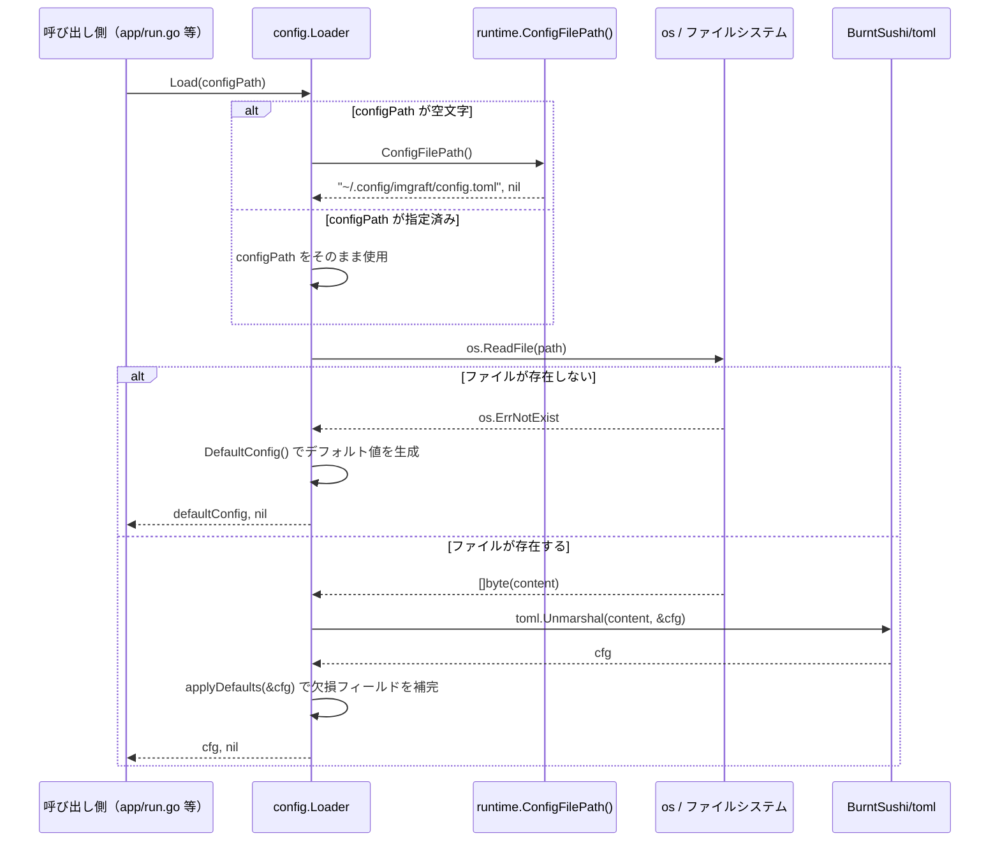
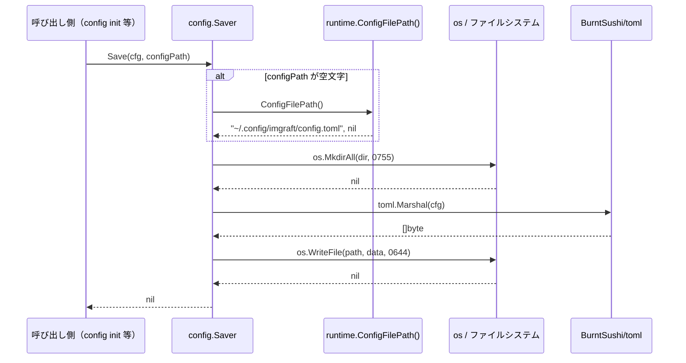
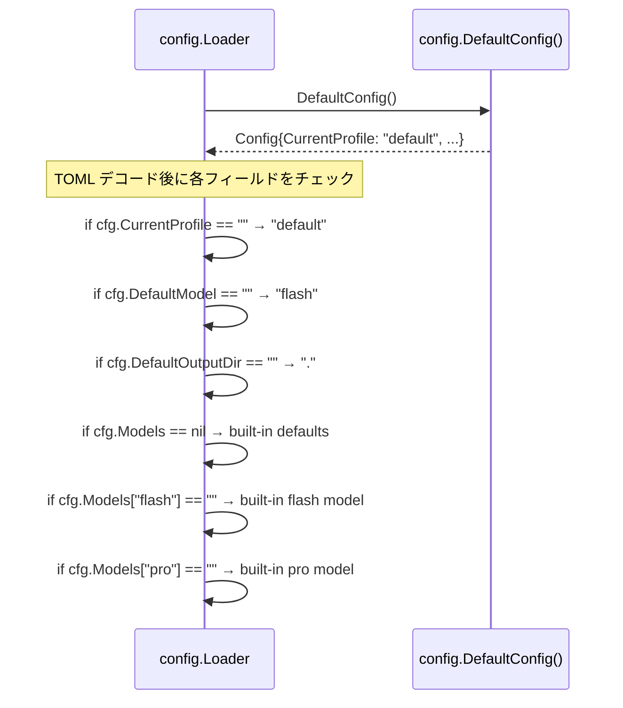

# M02: 設定管理

## Overview

| 項目 | 値 |
|------|---|
| ステータス | 未着手 |
| 依存 | M01（internal/runtime: paths.go, env.go, clock.go） |
| 計画ファイル | `plans/imgraft-m02-config.md` |
| 対象ファイル | `internal/config/types.go`, `internal/config/loader.go`, `internal/config/saver.go`, `internal/config/types_test.go`, `internal/config/loader_test.go`, `internal/config/saver_test.go` |

---

## Goal

- SPEC.md セクション 7.2 に定義された `config.toml` の読み書きを実装する
- `Config` 型を定義し、TOML シリアライズ/デシリアライズを提供する
- ファイルが存在しない場合のデフォルト値補完を実装する
- `--config` フラグによるカスタムパス指定をサポートする構造にする
- BurntSushi/toml を依存に追加する

---

## Sequence Diagram

### Config 読み込みフロー



### Config 保存フロー



### デフォルト値補完フロー



---

## TDD Test Design

### `internal/config/types_test.go`

| # | テストケース | 入力 | 期待出力 |
|---|-------------|------|---------|
| 1 | DefaultConfig が全フィールドを正しく返す | なし | CurrentProfile="default", LastUsedProfile="default", LastUsedBackend="google_ai_studio", DefaultModel="flash", DefaultOutputDir=".", Models に flash/pro が含まれる |
| 2 | Config の TOML タグが正しい | リフレクション検査 | 各フィールドに対応する toml タグが存在する |

### `internal/config/loader_test.go`

| # | テストケース | 入力 | 期待出力 |
|---|-------------|------|---------|
| 3 | 正常な TOML ファイルの読み込み | 完全な config.toml | 全フィールドが正しくデコードされる |
| 4 | ファイルが存在しない場合はデフォルト値を返す | 存在しないパス | DefaultConfig() と同等の値、error は nil |
| 5 | 空ファイルの読み込みでデフォルト値が補完される | 空の config.toml | DefaultConfig() と同等の値 |
| 6 | 部分的な TOML でデフォルト値が補完される | current_profile のみ設定 | current_profile は設定値、他はデフォルト |
| 7 | 不正な TOML でエラーを返す | 壊れた TOML | error が nil でない |
| 8 | models セクションの部分指定でデフォルト補完 | flash のみ指定 | flash は設定値、pro はデフォルト |
| 9 | カスタムパスでの読み込み | 一時ファイルパス | 指定パスのファイルが読み込まれる |
| 10 | configPath が空の場合は runtime.ConfigFilePath() を使用 | configPath="" | デフォルトパスが使用される（ファイル不在ならデフォルト値） |

### `internal/config/saver_test.go`

| # | テストケース | 入力 | 期待出力 |
|---|-------------|------|---------|
| 11 | Config を保存して再読み込みで一致 | DefaultConfig() | Save → Load で同一の Config |
| 12 | ディレクトリが存在しない場合に自動作成 | 存在しないディレクトリパス | ディレクトリが作成され、ファイルが書き込まれる |
| 13 | 保存ファイルのパーミッションが 0644 | 保存後に os.Stat | mode & 0777 == 0644 |
| 14 | 既存ファイルの上書き | 2回 Save | 2回目の内容で上書きされる |
| 15 | カスタムパスでの保存 | 一時ファイルパス | 指定パスにファイルが作成される |
| 16 | Models マップが TOML の [models] セクションとして出力される | flash/pro を含む Config | TOML 文字列に [models] セクションが含まれる |

---

## Implementation Steps

### Step 1: BurntSushi/toml 依存追加（Red 準備）

- `go get github.com/BurntSushi/toml` で依存追加

### Step 2: types.go — Config 型定義

- [ ] `internal/config/types.go` を作成
- [ ] `Config` 構造体を SPEC.md セクション 20.1 に準拠して定義
- [ ] `DefaultConfig()` 関数を実装
- [ ] built-in model defaults 定数を定義

### Step 3: types_test.go（Red → Green）

- [ ] `internal/config/types_test.go` を作成
- [ ] テスト #1, #2 を実装
- [ ] `go test` でグリーン確認

### Step 4: loader.go — TOML 読み込み

- [ ] `internal/config/loader.go` を作成
- [ ] `Load(configPath string) (*Config, error)` を実装
- [ ] ファイル不在時のデフォルト値返却を実装
- [ ] `applyDefaults(*Config)` で欠損フィールド補完を実装

### Step 5: loader_test.go（Red → Green）

- [ ] `internal/config/loader_test.go` を作成
- [ ] テスト #3-#10 を実装
- [ ] 一時ディレクトリ (`t.TempDir()`) を使用してファイルシステムテスト
- [ ] `go test` でグリーン確認

### Step 6: saver.go — TOML 書き込み

- [ ] `internal/config/saver.go` を作成
- [ ] `Save(cfg *Config, configPath string) error` を実装
- [ ] ディレクトリ自動作成 (`os.MkdirAll`) を実装
- [ ] パーミッション 0644 で書き込み

### Step 7: saver_test.go（Red → Green）

- [ ] `internal/config/saver_test.go` を作成
- [ ] テスト #11-#16 を実装
- [ ] Save → Load のラウンドトリップテスト
- [ ] `go test` でグリーン確認

### Step 8: Refactor

- [ ] `go vet ./...` でリント確認
- [ ] `go test ./...` で全テストグリーン確認
- [ ] 重複コードの整理（パス解決ロジック等）

---

## File Design

### `internal/config/types.go`

```go
package config

const (
    // DefaultProfile は初期 profile 名。
    DefaultProfile = "default"

    // DefaultBackend は v1 のデフォルト backend。
    DefaultBackend = "google_ai_studio"

    // DefaultModel は未指定時のデフォルトモデル alias。
    DefaultModelAlias = "flash"

    // DefaultOutputDir は未指定時の出力ディレクトリ。
    DefaultOutputDir = "."

    // BuiltinFlashModel は built-in fallback のflash モデル名。
    BuiltinFlashModel = "gemini-3.1-flash-image-preview"

    // BuiltinProModel は built-in fallback のpro モデル名。
    BuiltinProModel = "gemini-3-pro-image-preview"
)

// Config は ~/.config/imgraft/config.toml の構造体表現。
type Config struct {
    CurrentProfile   string            `toml:"current_profile"`
    LastUsedProfile  string            `toml:"last_used_profile"`
    LastUsedBackend  string            `toml:"last_used_backend"`
    DefaultModel     string            `toml:"default_model"`
    DefaultOutputDir string            `toml:"default_output_dir"`
    Models           map[string]string `toml:"models"`
}

// DefaultConfig はすべてのフィールドが既定値で埋まった Config を返す。
func DefaultConfig() *Config {
    return &Config{
        CurrentProfile:   DefaultProfile,
        LastUsedProfile:  DefaultProfile,
        LastUsedBackend:  DefaultBackend,
        DefaultModel:     DefaultModelAlias,
        DefaultOutputDir: DefaultOutputDir,
        Models: map[string]string{
            "flash": BuiltinFlashModel,
            "pro":   BuiltinProModel,
        },
    }
}
```

### `internal/config/loader.go`

```go
package config

import (
    "errors"
    "fmt"
    "os"

    "github.com/BurntSushi/toml"
    "github.com/youyo/imgraft/internal/runtime"
)

// Load は configPath から TOML を読み込み Config を返す。
// configPath が空文字の場合は runtime.ConfigFilePath() を使用する。
// ファイルが存在しない場合はデフォルト値を返す（エラーにしない）。
func Load(configPath string) (*Config, error) {
    path, err := resolvePath(configPath)
    if err != nil {
        return nil, fmt.Errorf("config path: %w", err)
    }

    data, err := os.ReadFile(path)
    if err != nil {
        if errors.Is(err, os.ErrNotExist) {
            return DefaultConfig(), nil
        }
        return nil, fmt.Errorf("read config: %w", err)
    }

    var cfg Config
    if err := toml.Unmarshal(data, &cfg); err != nil {
        return nil, fmt.Errorf("parse config: %w", err)
    }

    applyDefaults(&cfg)
    return &cfg, nil
}

// resolvePath は configPath が空なら runtime.ConfigFilePath() を返す。
func resolvePath(configPath string) (string, error) {
    if configPath != "" {
        return configPath, nil
    }
    return runtime.ConfigFilePath()
}

// applyDefaults は Config の欠損フィールドにデフォルト値を補完する。
func applyDefaults(cfg *Config) {
    if cfg.CurrentProfile == "" {
        cfg.CurrentProfile = DefaultProfile
    }
    if cfg.LastUsedProfile == "" {
        cfg.LastUsedProfile = DefaultProfile
    }
    if cfg.LastUsedBackend == "" {
        cfg.LastUsedBackend = DefaultBackend
    }
    if cfg.DefaultModel == "" {
        cfg.DefaultModel = DefaultModelAlias
    }
    if cfg.DefaultOutputDir == "" {
        cfg.DefaultOutputDir = DefaultOutputDir
    }
    if cfg.Models == nil {
        cfg.Models = make(map[string]string)
    }
    if cfg.Models["flash"] == "" {
        cfg.Models["flash"] = BuiltinFlashModel
    }
    if cfg.Models["pro"] == "" {
        cfg.Models["pro"] = BuiltinProModel
    }
}
```

### `internal/config/saver.go`

```go
package config

import (
    "bytes"
    "fmt"
    "os"
    "path/filepath"

    "github.com/BurntSushi/toml"
    "github.com/youyo/imgraft/internal/runtime"
)

// Save は Config を TOML 形式で configPath に保存する。
// configPath が空文字の場合は runtime.ConfigFilePath() を使用する。
// ディレクトリが存在しない場合は自動作成する。
func Save(cfg *Config, configPath string) error {
    path, err := resolvePath(configPath)
    if err != nil {
        return fmt.Errorf("config path: %w", err)
    }

    dir := filepath.Dir(path)
    if err := os.MkdirAll(dir, 0755); err != nil {
        return fmt.Errorf("create config dir: %w", err)
    }

    var buf bytes.Buffer
    enc := toml.NewEncoder(&buf)
    if err := enc.Encode(cfg); err != nil {
        return fmt.Errorf("encode config: %w", err)
    }

    if err := os.WriteFile(path, buf.Bytes(), 0644); err != nil {
        return fmt.Errorf("write config: %w", err)
    }

    return nil
}
```

---

## Risks

| リスク | 影響度 | 対策 |
|--------|--------|------|
| BurntSushi/toml の map[string]string が `[models]` セクションとして正しく出力されない | 中 | Save → Load ラウンドトリップテストで検証。TOML エンコーダーが map をテーブルとして出力することを確認 |
| TOML の空文字列とフィールド未設定の区別ができない | 低 | `applyDefaults` で空文字列をデフォルトに補完する設計。意図的に空文字を設定するユースケースは v1 では想定しない |
| `runtime.ConfigFilePath()` が HOME 未設定でエラーを返す | 低 | Load/Save ともにエラーを呼び出し元に伝播。テストではカスタムパスを指定して回避 |
| config.toml のパーミッション 0644 がセキュリティ上問題 | 低 | config.toml は API key を含まない（credentials.json が担当）。設定情報のみなので 0644 で問題なし |
| TOML エンコード時のフィールド順序が不安定 | 低 | 機能に影響なし。出力順序の安定性はテスト対象外とする |

---

## 補足: TDD 実装順と根拠

types → loader → saver の順で実装する。

1. **types.go**: 外部依存なし（構造体定義と定数のみ）。他の全ファイルが依存するためまず確立する
2. **loader.go**: BurntSushi/toml の Unmarshal を使用。ファイル不在時のデフォルト値返却がコアロジック。M11 の実行フローで最初に呼ばれる
3. **saver.go**: Encoder を使用。config init（M19）が直接依存。loader との対称性を検証するラウンドトリップテストが品質保証の要

---

## 関連ファイル

- `docs/specs/SPEC.md` セクション 7（設定ファイルと認証情報）
- `docs/specs/SPEC.md` セクション 7.2（config.toml スキーマ）
- `docs/specs/SPEC.md` セクション 7.5（設定値の解決優先順位）
- `docs/specs/SPEC.md` セクション 9.5（built-in defaults）
- `docs/specs/SPEC.md` セクション 20.1（Config 型）
- `internal/runtime/paths.go`（ConfigDir, ConfigFilePath）
- `plans/imgraft-roadmap.md`（ロードマップ）
- `plans/imgraft-m01-project-foundation.md`（前マイルストーン）

---

## Changelog

| 日時 | 種別 | 内容 |
|------|------|------|
| 2026-03-27 | 作成 | M02 詳細計画初版 |
