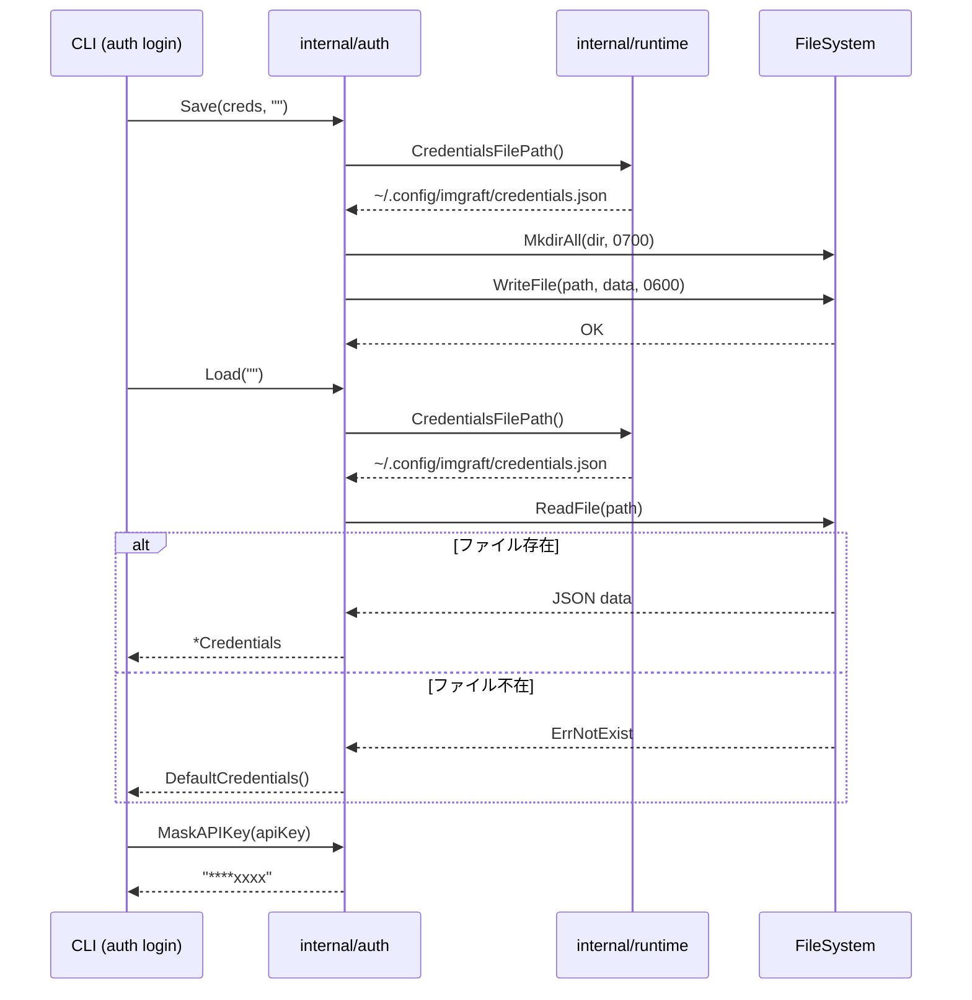

# M03 認証情報管理 実装詳細計画

## 概要

`internal/auth` パッケージを実装する。認証情報（credentials.json）の読み書き・型定義・APIキーのマスキングを担当する。

## 対象ファイル

| ファイル | 責務 |
|---------|------|
| internal/auth/types.go | Credentials, ProfileCredentials, GoogleAIStudioCredentials 型定義 |
| internal/auth/loader.go | credentials.json JSON 読込 |
| internal/auth/saver.go | credentials.json JSON 書込（0600 パーミッション） |
| internal/auth/validate.go | API key マスキング（末尾4文字のみ表示）|
| internal/auth/types_test.go | 型テスト |
| internal/auth/loader_test.go | loader テスト |
| internal/auth/saver_test.go | saver テスト |
| internal/auth/validate_test.go | validate テスト |

## パーミッション設計決定

**config.toml は 0644 / ディレクトリ 0755、credentials.json は 0600 / ディレクトリ 0700**

理由:
- `config.toml` は機密情報を含まず他ユーザーが読み取っても問題ないため 0644
- `credentials.json` は API key を平文で格納するため、オーナー以外のアクセスを完全に遮断する
- ディレクトリも同様に、credentials 格納パスは 0700 で他ユーザーの列挙を防ぐ
- 実際には `~/.config/imgraft/` は共有ディレクトリだが、credentials.json のファイルパーミッションで保護する
- Save 時に `MkdirAll` で 0700 を指定するが、既存ディレクトリのパーミッションは変更しない（config init が先に 0755 で作成した場合はそのまま）

## TDD 設計（Red -> Green -> Refactor）

### Step 1: types.go

テストケース:
- TestDefaultCredentials: DefaultCredentials() が非 nil の Profiles map を返すことを検証
- TestProfileCredentials_GoogleAIStudio: APIKey が正しく設定・取得できる
- TestCredentials_JSONMarshal: JSON にシリアライズして期待する構造になる
- TestCredentials_OmitEmpty: GoogleAIStudio が nil の場合 JSON に出現しない

### Step 2: loader.go

テストケース:
- TestLoad_FileNotExist: ファイル不在時に DefaultCredentials を返す
- TestLoad_ValidJSON: 有効な JSON を正しくパースできる
- TestLoad_InvalidJSON: 不正 JSON でエラーを返す
- TestLoad_EmptyPath: 空パスで runtime.CredentialsFilePath() を使い、ファイル不在ならデフォルト値を返す
- TestLoad_MultipleProfiles: 複数 profile を正しく読み込む
- TestLoad_NilProfilesHandled: profiles が null の JSON でも空 map になる

### Step 3: saver.go

テストケース:
- TestSave_CreatesFile: 指定パスにファイルが作成される
- TestSave_FilePermission: ファイルパーミッションが 0600 になる
- TestSave_DirPermission: 新規作成ディレクトリのパーミッションが 0700 になる
- TestSave_JSONRoundTrip: Save -> Load でデータが一致する
- TestSave_CreatesParentDir: 親ディレクトリが存在しなくても作成する
- TestSave_NilCredentials: nil を渡した場合にエラーを返す
- TestSave_ValidJSON: 保存された JSON が整形されている

### Step 4: validate.go

テストケース:
- TestMaskAPIKey_ShortKey: 4文字以下は "****" を返す
- TestMaskAPIKey_EmptyKey: 空文字は "****" を返す
- TestMaskAPIKey_NormalKey: 末尾4文字のみ表示
- TestMaskAPIKey_ExactlyFour: 4文字は "****" を返す
- TestMaskAPIKey_FiveChars: 5文字（最小正常ケース）で "****" + 末尾4文字
- TestHasBackend_GoogleAIStudio: APIKey あり -> true
- TestHasBackend_EmptyAPIKey: APIKey 空文字 -> false
- TestHasBackend_NilBackend: GoogleAIStudio が nil -> false
- TestHasBackend_UnknownBackend: 未知 backend -> false
- TestGetAPIKey_GoogleAIStudio: 正常取得
- TestGetAPIKey_NotFound: 存在しない場合 false

## Mermaid シーケンス図

## リスク評価

| リスク | 深刻度 | 対策 |
|--------|--------|------|
| ファイルパーミッション設定漏れ | 高 | os.WriteFile に 0600 を明示。テストで検証 |
| ディレクトリパーミッション不整合 | 高 | 新規作成時は 0700。テストで検証 |
| 並行書き込みによる破損 | 中 | v1 では単一プロセスのみ想定。将来は atomic write で対応 |
| runtime パッケージ名衝突 | 低 | import alias なしで使うが標準 runtime との混在に注意 |
| nil Credentials での Save | 中 | nil チェックを実装しエラーを返す |
| JSON indent 形式変更 | 低 | テストは構造のみ検証しフォーマットには依存しない |

## 実装順序

1. `internal/auth/types.go` + `types_test.go`（型定義確立）
2. `internal/auth/loader.go` + `loader_test.go`（読込実装）
3. `internal/auth/saver.go` + `saver_test.go`（書込実装）
4. `internal/auth/validate.go` + `validate_test.go`（ユーティリティ実装）
5. `go test ./internal/auth/...` で全テスト green 確認
6. リファクタリング（重複排除、コメント整備）

## 完了基準

- `go test ./internal/auth/...` が全て green
- `go vet ./internal/auth/...` が警告なし
- すべてのファイルに適切なコメントがある
- saver_test.go でファイルパーミッション 0600 とディレクトリパーミッション 0700 が検証されている
- Save(nil, path) がエラーを返すことが検証されている

## Handoff 情報

### 認証解決優先順位について
SPEC.md 7.5 の認証解決順（`--profile` -> `current_profile` -> `last_used_profile`）のロジックは
M18（認証コマンド）で実装する。M03 は credentials の読み書き基盤のみを提供し、
profile 解決ロジックは含めない。M18 は本パッケージの Load/GetAPIKey を利用して解決ロジックを構築する。

### MaskAPIKey の前提
API key は Google AI Studio の仕様上 ASCII 文字のみで構成される。
MaskAPIKey は `len(key)` によるバイト長ベースのスライスを使用するが、
ASCII 前提のため問題ない。この前提はコード内コメントに明記する。
