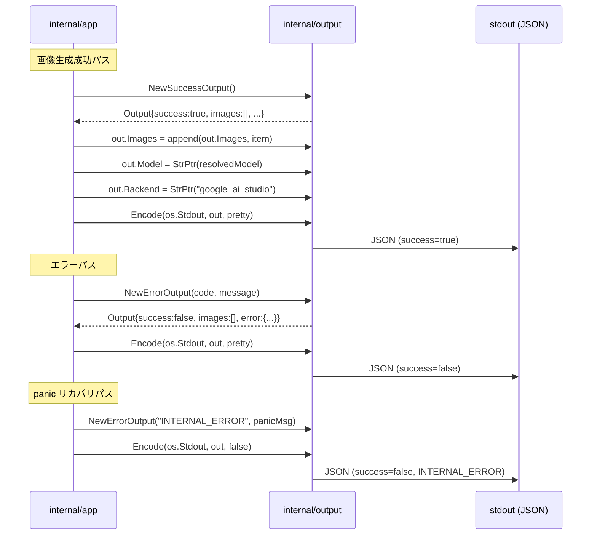

# M05: JSON 出力契約 実装詳細計画

## メタ情報

| 項目 | 値 |
|------|---|
| マイルストーン | M05 |
| タイトル | JSON 出力契約 |
| 依存 | M04 (errs パッケージ) |
| 作成日 | 2026-03-28 |
| ステータス | 計画済み |

## 目標

`internal/output` パッケージを実装し、imgraft の stdout JSON 契約を確立する。
成功・失敗どちらのケースでも同一スキーマを保証し、LLM agent が安定してパースできる出力を提供する。

---

## スコープ

### 対象ファイル

```
internal/output/
  types.go      # Output, ImageItem, OutputError, RateLimit 型定義
  json.go       # JSON encoder, NewSuccessOutput, NewErrorOutput, Encode 関数
  helpers.go    # null ポインタ生成ヘルパー (StrPtr, IntPtr など)
  types_test.go # 型定義・スキーマ固定テスト
  json_test.go  # エンコーダーテスト
```

### 対象外

- ファイル保存ロジック (M10 スコープ)
- rate_limit ヘッダー解析 (M16 スコープ)
- 実際の API 呼び出し (M08 スコープ)

---

## TDD 設計 (Red → Green → Refactor)

### Phase 1: Red — 先に書くテスト

#### `internal/output/types_test.go`

```go
// テストケース一覧

// TestOutputSchema_FieldsAlwaysPresent
// 成功時: success=true, images=[...], warnings=[], error={code:null, message:null}
// すべてのフィールドが JSON に存在すること (omitempty 禁止)

// TestOutputSchema_NullFields
// model が nil のとき "model": null が出力されること
// backend が nil のとき "backend": null が出力されること
// error.code が nil のとき "code": null が出力されること

// TestRateLimit_NullInitial
// NewEmptyRateLimit() がすべてのフィールドを null にすること

// TestImageItem_AllFields
// index, path, filename, width, height, mime_type, sha256, transparent_applied が揃うこと
```

#### `internal/output/json_test.go`

```go
// TestEncode_SuccessMinimal
// 最小構成の成功出力を JSON エンコードして期待スキーマと一致するか

// TestEncode_ErrorOutput
// NewErrorOutput でエラー出力を作成し、success=false, images=[], error.code が正しいか

// TestEncode_PrettyPrint
// pretty=true でインデント付き JSON になるか

// TestEncode_ImagesNilToEmptyArray
// 失敗時 Images が nil でも "images": [] が出力されること (null になってはいけない)

// TestEncode_WarningsNilToEmptyArray
// Warnings が nil でも "warnings": [] が出力されること

// TestEncode_FullSuccessOutput
// 全フィールドを設定した成功出力が期待 JSON と一致するか

// TestNewSuccessOutput
// NewSuccessOutput の返り値が success=true, error={code:null, message:null} であること

// TestNewErrorOutput
// NewErrorOutput の返り値が success=false, images=[] であること

// TestHelpers_StrPtr
// StrPtr("hello") が *string を返すこと

// TestHelpers_IntPtr
// IntPtr(42) が *int を返すこと
```

### Phase 2: Green — 最小実装

型定義 → ヘルパー → エンコーダー の順に実装。

### Phase 3: Refactor

- エラーハンドリングの整理
- ドキュメントコメントの追加
- ヘルパー関数の汎用化

---

## 実装ステップ

### Step 1: ディレクトリ作成

```bash
mkdir -p internal/output
```

### Step 2: `internal/output/helpers.go` — ポインタヘルパー

```go
package output

// StrPtr は文字列を *string に変換するヘルパーです。
// JSON 出力で null を表現するために使います。
func StrPtr(s string) *string { return &s }

// IntPtr は int を *int に変換するヘルパーです。
func IntPtr(i int) *int { return &i }
```

### Step 3: `internal/output/types.go` — 型定義

SPEC.md セクション 20.3-20.4 の型をそのまま実装。

```go
package output

// RateLimit はAPIレートリミット情報を保持します。
// 値が取得できないフィールドは nil (JSON: null) にします。
// SPEC.md セクション 15 参照。
type RateLimit struct {
    Provider          *string `json:"provider"`
    LimitType         *string `json:"limit_type"`
    RequestsLimit     *int    `json:"requests_limit"`
    RequestsRemaining *int    `json:"requests_remaining"`
    RequestsUsed      *int    `json:"requests_used"`
    ResetAt           *string `json:"reset_at"`
    RetryAfterSeconds *int    `json:"retry_after_seconds"`
}

// Output は imgraft の stdout JSON スキーマのルート型です。
// 成功・失敗どちらでも同一スキーマを使います。
// SPEC.md セクション 14.2 参照。
type Output struct {
    Success   bool        `json:"success"`
    Model     *string     `json:"model"`
    Backend   *string     `json:"backend"`
    Images    []ImageItem `json:"images"`
    RateLimit RateLimit   `json:"rate_limit"`
    Warnings  []string    `json:"warnings"`
    Error     OutputError `json:"error"`
}

// ImageItem は生成された1枚の画像に関するメタデータです。
type ImageItem struct {
    Index              int    `json:"index"`
    Path               string `json:"path"`
    Filename           string `json:"filename"`
    Width              int    `json:"width"`
    Height             int    `json:"height"`
    MimeType           string `json:"mime_type"`
    SHA256             string `json:"sha256"`
    TransparentApplied bool   `json:"transparent_applied"`
}

// OutputError はエラー情報を保持します。
// 成功時は Code, Message どちらも nil (JSON: null) です。
type OutputError struct {
    Code    *string `json:"code"`
    Message *string `json:"message"`
}
```

**重要な設計決定**: `omitempty` は一切使わない。フィールドが常に出力されるよう保証する。

### Step 4: `internal/output/json.go` — エンコーダーと構築ヘルパー

```go
package output

import (
    "bytes"
    "encoding/json"
    "io"
)

// NewEmptyRateLimit は全フィールドが null の RateLimit を返します。
func NewEmptyRateLimit() RateLimit {
    return RateLimit{} // すべてのポインタが nil → JSON で null
}

// NewSuccessOutput は成功時の Output を構築します。
// caller は Images, Model, Backend, RateLimit, Warnings を設定してください。
func NewSuccessOutput() Output {
    return Output{
        Success:   true,
        Images:    []ImageItem{},  // nil ではなく空スライスで初期化
        RateLimit: NewEmptyRateLimit(),
        Warnings:  []string{},     // nil ではなく空スライスで初期化
        Error:     OutputError{},  // Code, Message は nil
    }
}

// NewErrorOutput は失敗時の Output を構築します。
// code には errs.ErrorCode を文字列変換したものを渡します。
// message には人間向けエラーメッセージを渡します。
func NewErrorOutput(code, message string) Output {
    return Output{
        Success:   false,
        Images:    []ImageItem{},  // 失敗時は空配列
        RateLimit: NewEmptyRateLimit(),
        Warnings:  []string{},
        Error: OutputError{
            Code:    StrPtr(code),
            Message: StrPtr(message),
        },
    }
}

// Encode は out を JSON エンコードして w に書き込みます。
// pretty=true のとき 2 スペースインデントの整形済み JSON を出力します。
// nil スライスは空配列に正規化し、バッファ経由で書き込むことで
// 部分書き込みを防止します。
func Encode(w io.Writer, out Output, pretty bool) error {
    // nil スライス防御: 呼び出し元が NewSuccessOutput/NewErrorOutput を
    // 使わなかった場合でもスキーマを保証する
    if out.Images == nil {
        out.Images = []ImageItem{}
    }
    if out.Warnings == nil {
        out.Warnings = []string{}
    }

    // バッファ経由で書き込み、部分書き込みを防止
    var buf bytes.Buffer
    enc := json.NewEncoder(&buf)
    if pretty {
        enc.SetIndent("", "  ")
    }
    if err := enc.Encode(out); err != nil {
        return err
    }
    _, err := buf.WriteTo(w)
    return err
}
```

**重要な設計決定**:
- `Images []ImageItem` は `make([]ImageItem, 0)` または `[]ImageItem{}` で初期化することで `"images": null` ではなく `"images": []` を保証する。
- `Warnings []string` も同様。
- `json.NewEncoder` + `enc.SetIndent` で pretty/compact を切り替える。

### Step 5: テストを走らせて Green を確認

```bash
go test ./internal/output/...
```

### Step 6: Refactor

- すべてのエクスポート型・関数に godoc コメントを追加
- `json_test.go` に `testdata/` の golden file 比較テストを追加検討
- `go vet ./internal/output/...` でクリーンを確認

---

## Mermaid シーケンス図



---

## リスク評価

### リスク 1: `null` vs `omitempty` の混在

**問題**: Go の `encoding/json` は `omitempty` タグがあるとゼロ値フィールドを省略する。スキーマが固定でなくなる。

**対策**: すべての JSON タグに `omitempty` を一切付けない。ポインタ型フィールドは `nil` のまま → JSON で `null` と出力される。

**テストで保証**: `TestOutputSchema_FieldsAlwaysPresent` でスキーマの全フィールドが JSON に存在することを確認する。

```go
// 確認方法: json.Marshal した結果を map[string]interface{} にデコードして
// キーが存在するか検査する
var m map[string]interface{}
json.Unmarshal(b, &m)
assert.Contains(t, m, "model")  // null でもキーは存在する
assert.Contains(t, m, "backend")
```

### リスク 2: `Images` が `nil` になる問題

**問題**: `var out Output` で宣言すると `out.Images == nil` → `"images": null` が出力される。

**対策**: `NewSuccessOutput()` / `NewErrorOutput()` 内で必ず `[]ImageItem{}` で初期化する。`nil` スライスを直接使う経路を作らない。

**テストで保証**: `TestEncode_ImagesNilToEmptyArray` でこのケースを明示的にテストする。

### リスク 3: `Warnings` が `nil` になる問題

**問題**: `Images` と同じ問題が `Warnings []string` にも起きる。

**対策**: 同様に `[]string{}` で初期化する。

### リスク 4: pretty-print フラグの扱い

**問題**: `json.Marshal` + `json.MarshalIndent` の二択だと Encoder の設定が分散する。

**対策**: `json.NewEncoder(w)` を使い、pretty フラグで `enc.SetIndent("", "  ")` を切り替える。1つの `Encode` 関数で両方を制御する。

### リスク 5: `json.Encoder` の末尾改行

**問題**: `json.Encoder.Encode` は末尾に `\n` を追加する。`json.Marshal` は追加しない。

**対策**: `json.Encoder` を使うことで stdout に常に `\n` が付く。LLM agent がパースしやすい形式として問題なし。テストでは `strings.TrimSpace` で比較する。

### リスク 6: `errs.ErrorCode` → `string` 変換

**問題**: `OutputError.Code` は `*string` だが、`errs.ErrorCode` は `ErrorCode` 型。直接代入できない。

**対策**: `NewErrorOutput(string(errs.CodeOf(err)), err.Error())` のように明示的にキャストする。`output` パッケージは `errs` パッケージに依存しない設計にする（循環依存回避）。

---

## ファイル構成サマリ

```
internal/output/
  helpers.go      # StrPtr, IntPtr
  types.go        # RateLimit, Output, ImageItem, OutputError
  json.go         # NewEmptyRateLimit, NewSuccessOutput, NewErrorOutput, Encode
  types_test.go   # TestOutputSchema_*, TestRateLimit_*, TestImageItem_*
  json_test.go    # TestEncode_*, TestNew*Output, TestHelpers_*
```

### 注意事項 (品質レビューによる修正)

1. **Encode 関数の nil スライス防御**: `Encode` 内で `Images`/`Warnings` が nil の場合に空配列に置換
2. **部分書き込み防止**: `bytes.Buffer` 経由で書き込み、エンコード失敗時に stdout が汚染されない
3. **テストは標準ライブラリのみ**: testify 等の外部依存を使わない
4. **ヘルパーテストは json_test.go に統合**: helpers_test.go は不要

---

## 完了定義

- [ ] `internal/output/` 配下の全ファイルが実装済み
- [ ] `go test ./internal/output/...` が全 GREEN
- [ ] `go vet ./internal/output/...` がクリーン
- [ ] `go build ./...` がエラーなし
- [ ] テストカバレッジ 90% 以上
- [ ] すべてのエクスポート識別子に godoc コメントあり
- [ ] `null` フィールドのスキーマ固定テストが通過
- [ ] `"images": []` と `"warnings": []` の空配列テストが通過
