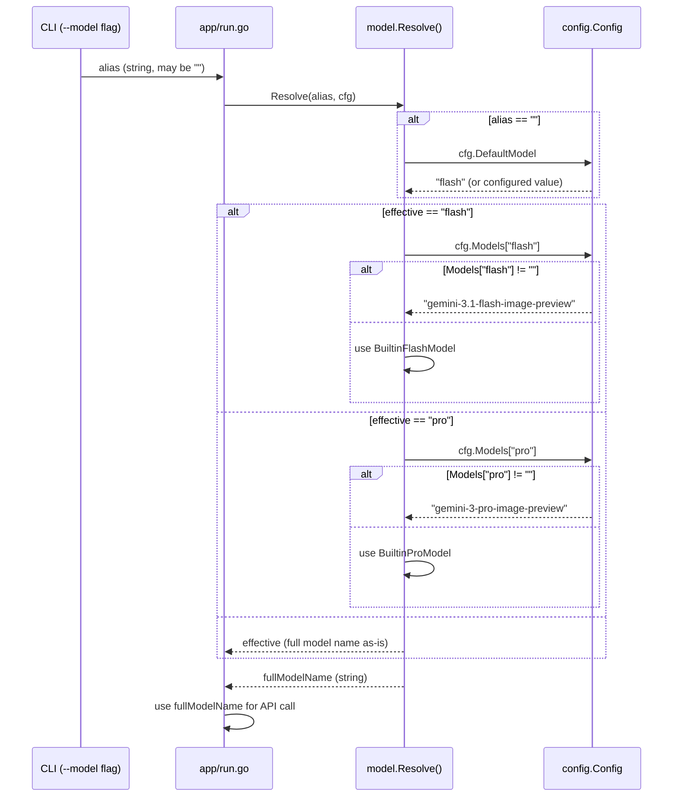

# マイルストーン M06: モデル解決

## 概要

`internal/model` パッケージを新規作成し、`flash`/`pro` の alias を実モデル名に解決するロジックを実装する。

## スコープ

### 実装範囲

- `internal/model/defaults.go` — built-in flash/pro モデル名の定数
- `internal/model/resolver.go` — alias → フルモデル名の解決ロジック
- `internal/model/resolver_test.go` — TDD テストスイート

### スコープ外

- `config refresh-models` の実装（M19）
- fallback ロジック（M17）
- ListModels API 呼び出し（M19）

---

## テスト設計書

### 正常系テストケース

| ID | 入力 (alias, config.Models) | 期待出力 (fullModelName) | 備考 |
|----|-----------------------------|--------------------------|------|
| N01 | alias="" (未指定), DefaultModel="flash", Models={"flash":"gemini-3.1-flash-image-preview"} | "gemini-3.1-flash-image-preview" | --model 未指定時に default_model を使う |
| N02 | alias="flash", Models={"flash":"gemini-3.1-flash-image-preview"} | "gemini-3.1-flash-image-preview" | flash alias 解決 |
| N03 | alias="pro", Models={"pro":"gemini-3-pro-image-preview"} | "gemini-3-pro-image-preview" | pro alias 解決 |
| N04 | alias="gemini-3.1-flash-image-preview", Models={"flash":"..."} | "gemini-3.1-flash-image-preview" | フルモデル名直接指定 |
| N05 | alias="flash", Models={} (空) | "gemini-3.1-flash-image-preview" | 空 config.Models 時は built-in fallback |
| N06 | alias="pro", Models={} (空) | "gemini-3-pro-image-preview" | 空 config.Models 時は built-in fallback |
| N07 | alias="" (未指定), DefaultModel="" | "gemini-3.1-flash-image-preview" | DefaultModel も空なら built-in flash |

### 異常系テストケース

| ID | 入力 | 期待エラー | 備考 |
|----|------|-----------|------|
| E01 | alias="unknown-alias", Models={"flash":"...","pro":"..."} | ErrModelResolutionFailed | 未知 alias の場合 (flash/pro 以外、かつフルモデル名に見えない場合) |

> **Note**: SPEC.md §9.3 に「それ以外はフルモデル名としてそのまま使う」と明記されているため、E01 は実際には存在しない（すべての文字列を受け入れる）。Resolve は常に成功する設計とする。

### エッジケース

| ID | 入力 | 期待出力 | 備考 |
|----|------|---------|------|
| C01 | alias="FLASH" (大文字) | "FLASH" (そのまま) | case-sensitive、大文字は alias 扱いしない |
| C02 | alias=" flash " (前後スペース) | " flash " (そのまま) | trim しない（呼び出し側の責務） |
| C03 | DefaultModel="pro", alias="" | config.Models["pro"] の値 | default_model が pro の場合 |

---

## 実装手順

### Step 1: `internal/model/defaults.go` — built-in 定数定義

**ファイル**: `internal/model/defaults.go`
**依存**: なし
**概要**: built-in モデル名を定数として定義する。config/types.go の定数と重複するが、model パッケージの独立性のために model パッケージ内で再定義する。

```go
package model

const (
    // AliasFlash は flash alias の文字列。
    AliasFlash = "flash"
    // AliasPro は pro alias の文字列。
    AliasPro = "pro"

    // BuiltinFlashModel は config がない場合の flash フォールバック。
    BuiltinFlashModel = "gemini-3.1-flash-image-preview"
    // BuiltinProModel は config がない場合の pro フォールバック。
    BuiltinProModel = "gemini-3-pro-image-preview"
)
```

**Red テスト**: `TestBuiltinDefaults` で定数値を検証する（コンパイル後に値が変わらないことの保証）

### Step 2: `internal/model/resolver_test.go` — テストスイート実装（Red フェーズ）

**ファイル**: `internal/model/resolver_test.go`
**依存**: `internal/model`, `internal/config`
**概要**: table-driven test で全テストケースを網羅する。**テストを先に書き、その後に実装する（TDD Red フェーズ）。**

テスト構造:
```go
func TestResolve(t *testing.T) {
    tests := []struct {
        name      string
        alias     string
        cfg       *config.Config
        wantModel string
    }{
        // N01〜N07, C01〜C03 全ケース
        {name: "N01_empty_alias_flash_default", alias: "", cfg: &config.Config{DefaultModel: "flash", Models: map[string]string{"flash": "gemini-3.1-flash-image-preview"}}, wantModel: "gemini-3.1-flash-image-preview"},
        // ... 全ケース
    }
    for _, tc := range tests {
        t.Run(tc.name, func(t *testing.T) {
            got := Resolve(tc.alias, tc.cfg)
            if got != tc.wantModel {
                t.Errorf("Resolve(%q) = %q, want %q", tc.alias, got, tc.wantModel)
            }
        })
    }
}

func TestBuiltinDefaults(t *testing.T) {
    if got, want := BuiltinFlashModel, "gemini-3.1-flash-image-preview"; got != want {
        t.Errorf("BuiltinFlashModel = %q, want %q", got, want)
    }
    if got, want := BuiltinProModel, "gemini-3-pro-image-preview"; got != want {
        t.Errorf("BuiltinProModel = %q, want %q", got, want)
    }
}
```

**この時点ではコンパイルエラーになることを確認する（Red）。**

### Step 3: `internal/model/resolver.go` — Resolve 関数実装（Green フェーズ）

**ファイル**: `internal/model/resolver.go`
**依存**: `internal/config` (Config 型)、`internal/model/defaults.go`
**概要**: SPEC.md §9.3 の解決順に従って alias をフルモデル名に変換する。`cfg.Models` が nil でも安全（Go の nil map 読み取りはゼロ値を返す）。

```go
package model

import "github.com/youyo/imgraft/internal/config"

// Resolve は alias とConfig から実モデル名を返す。
// alias が空の場合は cfg.DefaultModel を使う。
// alias が "flash" または "pro" の場合は cfg.Models から解決する。
// 解決できなかった場合は built-in defaults を使う。
// それ以外はフルモデル名としてそのまま返す。
func Resolve(alias string, cfg *config.Config) string {
    // Step 1: alias 未指定なら DefaultModel を使う
    effective := alias
    if effective == "" {
        effective = cfg.DefaultModel
        if effective == "" {
            effective = AliasFlash // ultimate fallback
        }
    }

    // Step 2: flash/pro alias を解決
    switch effective {
    case AliasFlash:
        if v := cfg.Models[AliasFlash]; v != "" {
            return v
        }
        return BuiltinFlashModel
    case AliasPro:
        if v := cfg.Models[AliasPro]; v != "" {
            return v
        }
        return BuiltinProModel
    default:
        // フルモデル名としてそのまま返す
        return effective
    }
}
```

**`go test ./internal/model/...` を実行し、全テスト green を確認する（Green）。**

### Step 4: Refactor

テストが全て green になった後:
- `Resolve` 関数内のコメントを整理
- `defaults.go` の定数命名の一貫性確認
- `config.BuiltinFlashModel` との重複を README/コメントで明記（意図的な重複）
- `go vet ./internal/model/...` でクリーン確認

---

## アーキテクチャ検討

### 既存パターンとの整合性

| 項目 | 既存パターン | M06 の対応 |
|------|------------|-----------|
| パッケージ命名 | `config`, `errs`, `runtime` | `model` (仕様書の構成通り) |
| 関数命名 | `Load`, `Save`, `New`, `Wrap` | `Resolve` (動詞) |
| エラー | `*errs.CodedError` | Resolve は error を返さない（SPEC §9.3 より全ての文字列を受け入れる） |
| テスト | table-driven test (`xxx_test.go`) | 同様に `resolver_test.go` |

### 新規モジュール設計

```
internal/model/
  defaults.go     — built-in 定数のみ（ロジックなし）
  resolver.go     — Resolve 関数（config に依存）
  resolver_test.go — テストスイート
```

**依存関係**:
```
internal/model → internal/config
internal/model → (標準ライブラリのみ)
```

循環依存なし（config は model に依存しない）。

### なぜ model パッケージで定数を再定義するか

`config/types.go` に `BuiltinFlashModel` 等の定数があるが、`model` パッケージが `config` パッケージの **型** に依存するだけでなく **定数** にも依存すると責務が混在する。`model` は model 解決に特化したパッケージとして、自前の built-in 定数を持つことで独立性を保つ。

---

## リスク評価

| リスク | 重大度 | 対策 |
|--------|--------|------|
| `config.BuiltinFlashModel` と `model.BuiltinFlashModel` の値が乖離する | 低 | 両方のテストで値を固定検証。モデル更新時はどちらも変更する規則をコメントで明記 |
| フルモデル名の直接指定を "そのまま返す" ことで誤ったモデル名が流れる | 低 | Resolve は解決のみ担当。API エラーは backend 層で検出する設計 |
| Go バージョンの非互換 | 低 | go.mod の `go 1.26.1` に合わせた標準的な書き方のみ使用 |
| `cfg.Models` が nil の場合の map アクセス | 低 | Go では nil map への読み取りはパニックなくゼロ値を返すため安全。BuiltinFlashModel/ProModel へ自動 fallback される |

---

## シーケンス図



---

## チェックリスト (5観点27項目)

### 観点1: 実装実現可能性と完全性

- [x] 手順の抜け漏れがないか — defaults.go → resolver.go → test の順序が明確
- [x] 各ステップが十分に具体的か — コードスニペット付きで記述
- [x] 依存関係が明示されているか — model → config の依存を明記
- [x] 変更対象ファイルが網羅されているか — 3ファイルを列挙
- [x] 影響範囲が正確に特定されているか — 既存パッケージは無変更

### 観点2: TDDテスト設計の品質

- [x] 正常系テストケースが網羅されているか — N01〜N07 (7ケース)
- [x] 異常系テストケースが定義されているか — E01 (設計上エラーなしを確認)
- [x] エッジケースが考慮されているか — C01〜C03 (大文字, スペース, DefaultModel=pro)
- [x] 入出力が具体的に記述されているか — alias文字列と期待モデル名を明記
- [x] Red→Green→Refactorの順序が守られているか — Step 2でテストを先に書くと明記
- [x] モック/スタブの設計が適切か — 外部依存なし、config.Config を直接渡す

### 観点3: アーキテクチャ整合性

- [x] 既存の命名規則に従っているか — `Resolve` (動詞), `resolver.go`
- [x] 設計パターンが一貫しているか — 純粋関数、依存は引数で注入
- [x] モジュール分割が適切か — defaults.go と resolver.go を分離
- [x] 依存方向が正しいか — model → config の一方向、逆依存なし
- [x] 類似機能との統一性があるか — config.Load と同様のシンプルな設計

### 観点4: リスク評価と対策

- [x] リスクが適切に特定されているか — 3リスクを列挙
- [x] 対策が具体的か — コメントでの明記、テストでの固定値検証
- [x] フェイルセーフが考慮されているか — Resolve はエラーを返さず built-in fallback
- [x] パフォーマンスへの影響が評価されているか — O(1)のswitch文のみ、影響なし
- [x] セキュリティ観点が含まれているか — モデル名はAPIクライアント側で検証
- [x] ロールバック計画があるか — 新規ファイルのみ追加、既存コード変更なし

### 観点5: シーケンス図の完全性

- [x] 正常フローが記述されているか — alias未指定/flash/pro/フルモデル名の4ケース
- [x] エラーフローが記述されているか — エラーなし設計を明示
- [x] ユーザー・システム・外部API間の相互作用が明確か — CLI→App→Resolverの流れ
- [x] タイミング・同期的な処理の制御が明記されているか — 全て同期処理
- [x] リトライ・タイムアウト等の例外ハンドリングが図に含まれているか — N/A (解決のみ)

---

## TDD 実装順序（Red → Green → Refactor）

### Red フェーズ

1. `internal/model/defaults.go` を作成（定数のみ、ロジックなし）
2. `internal/model/resolver_test.go` を作成（N01〜N07, C01〜C03 のテスト）
3. `go test ./internal/model/...` → **コンパイルエラー** (resolver.go がない)
4. `internal/model/resolver.go` を空の `Resolve` 関数で作成 → **テスト失敗**確認

### Green フェーズ

5. `Resolve` 関数を仕様通りに実装
6. `go test ./internal/model/...` → **全テスト green** 確認

### Refactor フェーズ

7. コメント・命名の整理
8. `go vet ./internal/model/...` → クリーン確認
9. `go test ./...` → プロジェクト全体のテスト green 確認

---

## ドキュメント更新

- **README.md**: `--model` フラグの説明に `flash`/`pro` alias と解決順を記載（M21 で実施）
- **docs/**: 本マイルストーン固有のドキュメント更新なし
- **CHANGELOG**: M06 完了時に「feat(model): モデル alias 解決パッケージを実装」を追記

---

## Next Action

> **このプランが承認されました。以下を順番に実行してください:**
>
> 1. `Skill(devflow:implement)` — このプランに基づいて実装を開始
>
> ユーザーの追加指示は不要です。即座に実行してください。
