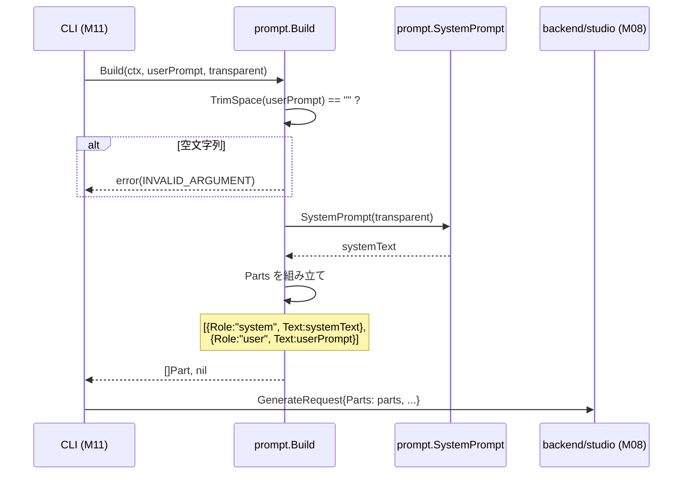

# マイルストーン M07: プロンプト構築

## 概要

transparent ON/OFF のシステムプロンプト定義と、ユーザープロンプトとのメッセージ合成ロジックを実装する。

## スコープ

### 実装範囲

- `internal/prompt/system.go` — transparent ON/OFF ごとのシステムプロンプト文字列定数
- `internal/prompt/builder.go` — システムプロンプト + ユーザープロンプトを合成し API リクエスト向け `[]Part` を生成するビルダー

### スコープ外

- API 呼び出し自体（M08 の責務）
- 参照画像の Parts 変換（M12/M13 の責務）
- `--no-transparent` フラグの CLI 解析（M11 の責務）
- system prompt に含まれるプロンプトのユーザー公開・変更可能化

---

## SPEC 参照箇所

| セクション | 内容 |
|-----------|------|
| §11.1 | user prompt をそのまま投げない、system prompt でアセット生成誘導 |
| §11.2 | transparent ON 時の system prompt（全文） |
| §11.3 | transparent OFF 時の緩和ルール |
| §11.4 | ユーザー背景指定は CLI が上書き（透明モードが勝つ） |
| §12.1 | transparent デフォルト ON |
| §12.3 | 背景固定色 `#00FF00` |
| §19.1 | step 7: prompt build（CLI→API の間） |

---

## テスト設計書（TDD: Red → Green → Refactor）

### 正常系テストケース

| ID | 関数 / 入力 | 期待出力 | 備考 |
|----|------------|---------|------|
| T01 | `SystemPrompt(true)` | `#00FF00` 背景強制文字列を含む長文 | transparent ON |
| T02 | `SystemPrompt(false)` | 空文字列を返す | transparent OFF（SPEC §11.3: 背景強制を外す → 空文字列） |
| T03 | `Build(ctx, "blue robot mascot", true)` | Parts=[{system,SystemPrompt(true)},{user,"blue robot mascot"}] len=2 | transparent ON |
| T04 | `Build(ctx, "cute cat", false)` | Parts=[{user,"cute cat"}] len=1 | transparent OFF: system prompt 空のため省略 |
| T05 | `Build` で transparent=true の場合、Parts[0] が system role / text | role 順序保証 | |
| T06 | `SystemPrompt(true)` が "solid pure green background" を含む | SPEC §11.2 文言固定 | |
| T07 | `SystemPrompt(true)` が "Center the subject" を含む | SPEC §11.2 文言固定 | |

### 異常系テストケース

| ID | 入力 | 期待挙動 | 備考 |
|----|------|---------|------|
| T08 | `Build(ctx, "", true)` | `*errs.CodedError{Code: INVALID_ARGUMENT}` を返す | ユーザープロンプト必須 |
| T09 | `Build(ctx, "   ", true)` | `*errs.CodedError{Code: INVALID_ARGUMENT}` を返す | trim 後に空になる |

### エッジケース

| ID | 入力 | 期待挙動 |
|----|------|---------|
| T10 | prompt に改行・タブを含む | そのまま保持して Parts に入る |
| T11 | prompt に日本語を含む | UTF-8 のまま扱われる |
| T12 | prompt に `#00FF00` という文言が含まれる | system prompt 側の制御を上書きしない（CLI 設計で制御済み） |
| T13 | `Build(ctx, "test", false)` の Parts 長さ | len(Parts)==1, Parts[0].Role=="user" | transparent OFF で system 省略 |

---

## 実装手順

### Step 1: Red — テストファイル作成

**ファイル**: `internal/prompt/system_test.go`, `internal/prompt/builder_test.go`

- `system_test.go` に T01, T02, T06, T07 を記述（`SystemPrompt` 関数をテスト）
- `builder_test.go` に T03〜T05, T08〜T12 を記述（`Build` 関数をテスト）
- この時点でビルドエラーになることを確認（関数が存在しないため）

### Step 2: Red — ディレクトリ・ファイル構造作成

```
internal/prompt/
  system.go       # SystemPrompt 関数
  builder.go      # Build 関数・PromptParts 型
  system_test.go  # (Step 1 で作成済み)
  builder_test.go # (Step 1 で作成済み)
```

### Step 3: Green — `internal/prompt/system.go` 実装

```go
package prompt

// SystemPrompt は transparent モードに応じたシステムプロンプト文字列を返す。
// transparent=true のとき SPEC §11.2 の固定文言を返す。
// transparent=false のとき SPEC §11.3 に従い緩和した文字列を返す（空文字列可）。
func SystemPrompt(transparent bool) string { ... }
```

- transparent=true: SPEC §11.2 の全文をハードコード
- transparent=false: 空文字列を返す（SPEC §11.3 は「少なくとも以下は外す」のみで残す内容を規定していないため、v1 では空として扱う）

### Step 4: Green — `internal/prompt/builder.go` 実装

```go
package prompt

import (
    "context"
    "strings"

    "github.com/youyo/imgraft/internal/errs"
)

// Part はプロンプトの1要素（role + text）。
// 将来 inline_data（参照画像）を加えられる構造にしておく。
type Part struct {
    Role string // "system" | "user"
    Text string
}

// Build はユーザープロンプトと transparent フラグからリクエスト用 Parts を返す。
// 参照画像 Parts の挿入は参照画像ローダー（M12/M13）に委ねるため、ここでは扱わない。
func Build(_ context.Context, userPrompt string, transparent bool) ([]Part, error) { ... }
```

- `strings.TrimSpace(userPrompt) == ""` のとき `errs.New(errs.ErrInvalidArgument, "user prompt is required")` を返す
- 返す Parts: `[{Role:"system", Text: SystemPrompt(transparent)}, {Role:"user", Text: userPrompt}]`
- transparent=false かつ `SystemPrompt(false)` が空文字列のとき、system Part を含めない

### Step 5: Refactor

- `system.go` の定数化 — `transparentSystemPrompt` / `noTransparentSystemPrompt` を unexported const として抽出
- `Build` の役割明確化コメントを補強
- テストが引き続き通ることを確認

---

## アーキテクチャ検討

### 既存パターンとの整合性

| 観点 | 方針 |
|------|------|
| パッケージ命名 | `internal/prompt` — SPEC §5 のディレクトリ構成に完全一致 |
| エラーハンドリング | `errs.New(errs.ErrInvalidArgument, msg)` で `*CodedError` を返す（M04 実装済み） |
| `context.Context` | `Build` は将来の計装・キャンセル対応のため第1引数に持つ |
| テストパターン | `*_test.go` を同パッケージ内に配置（他パッケージと同様） |

### 依存関係

```
internal/prompt
  ├── 依存: internal/errs  (M04 実装済み)
  └── 依存なし: config / model（build 時に不要）
```

循環依存なし。prompt パッケージは純粋な文字列生成責務に閉じる。

### `Part` 型について

M08（Studio API クライアント）では Google AI の `Content` / `Part` 型が必要になる。
`internal/prompt.Part` は **imgraft 内部型** として定義し、M08 のアダプター層で
Google API 型に変換する設計とする。これにより prompt パッケージが外部 SDK に依存しない。

---

## リスク評価

| リスク | 重大度 | 対策 |
|--------|--------|------|
| SPEC §11.2 の文言が将来変更される | 低 | `system.go` の定数を1箇所に集約済み。変更はその1箇所のみ |
| transparent=false で空文字列を返すと M08 で null system prompt になる | 低 | Build 側で空 Text の Part を除外するロジックを入れる |
| prompt パッケージの `Part` 型と M08 の SDK 型との変換漏れ | 中 | M08 実装時にアダプター関数を明示的に実装し unit test を書く |
| ユーザープロンプトに制御文字が含まれる | 低 | API 側でハンドリング。v1 ではバリデーション不要（SPEC に記載なし） |

---

## シーケンス図



---

## 実装チェックリスト（5観点27項目）

### 観点1: 実装実現可能性（5項目）

- [x] 手順の抜け漏れがない（system.go → builder.go の2ファイル構成で網羅）
- [x] 各ステップが具体的（関数シグネチャ・ロジックを明記）
- [x] 依存関係が明示（errs のみ、循環なし）
- [x] 変更対象ファイルが網羅（system.go, builder.go, 2テストファイル）
- [x] 影響範囲が特定済み（prompt パッケージのみ）

### 観点2: TDDテスト設計（6項目）

- [x] 正常系テストケース（T01〜T07）
- [x] 異常系テストケース（T08〜T09）
- [x] エッジケース（T10〜T12）
- [x] 入出力が具体的（期待文言・エラー定数を明記）
- [x] Red→Green→Refactor の順序を遵守
- [x] 外部依存なし（モック不要、純粋関数）

### 観点3: アーキテクチャ整合性（5項目）

- [x] 既存命名規則に従う（`internal/prompt/`, `*_test.go`）
- [x] 設計パターンが一貫（pure function + error return）
- [x] モジュール分割が適切（system / builder の2ファイル）
- [x] 依存方向が正しい（prompt → errs の一方向）
- [x] 類似機能との統一性あり（errs パッケージを利用）

### 観点4: リスク評価（6項目）

- [x] リスクが特定されている
- [x] 対策が具体的
- [x] フェイルセーフ考慮（空プロンプトはエラー返却）
- [x] パフォーマンス影響なし（純粋な文字列処理）
- [x] セキュリティ: プロンプトインジェクション — CLI の transparent 優先設計で対策済み
- [x] ロールバック不要（新規パッケージ追加のみ）

### 観点5: シーケンス図（5項目）

- [x] 正常フローが記述されている
- [x] エラーフロー（空プロンプト）が記述されている
- [x] CLI・Builder・System・API の相互作用が明確
- [x] 同期処理の制御が明記されている
- [x] タイムアウト等は prompt パッケージの責務外（N/A）

---

## ファイル変更一覧

| ファイル | 変更種別 | 備考 |
|---------|---------|------|
| `internal/prompt/system.go` | 新規作成 | SystemPrompt 関数 |
| `internal/prompt/builder.go` | 新規作成 | Part 型・Build 関数 |
| `internal/prompt/system_test.go` | 新規作成 | T01, T02, T06, T07 |
| `internal/prompt/builder_test.go` | 新規作成 | T03〜T12 |

---

## 完了条件

- `go test ./internal/prompt/...` が全テスト green
- `go vet ./internal/prompt/...` エラーなし
- SPEC §11.2 の system prompt 全文が `SystemPrompt(true)` の返り値に含まれる
- 空プロンプトで `INVALID_ARGUMENT` 相当のエラーが返る

---

## Next Action

> **このプランが承認されました。以下を順番に実行してください:**
>
> 1. `Skill(devflow:implement)` — このプランに基づいて実装を開始
>
> ユーザーの追加指示は不要です。即座に実行してください。
