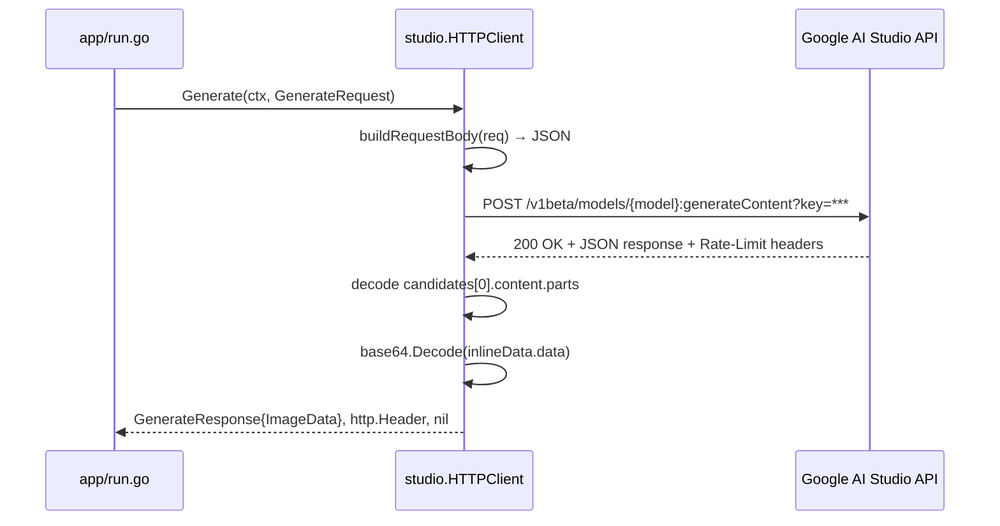
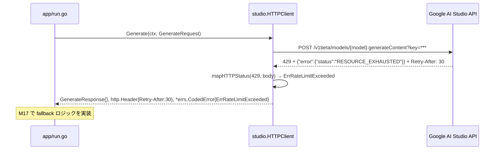
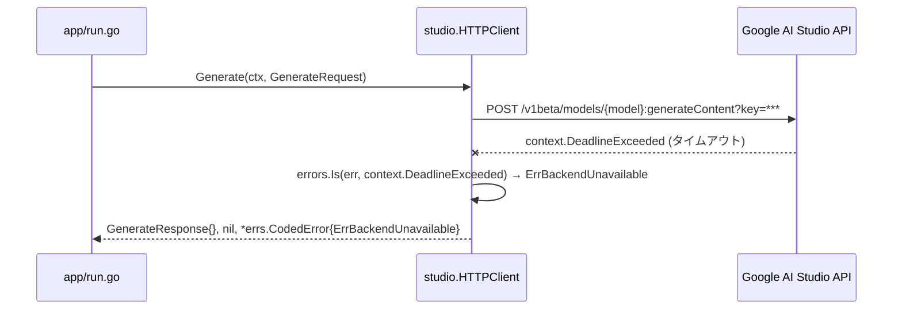
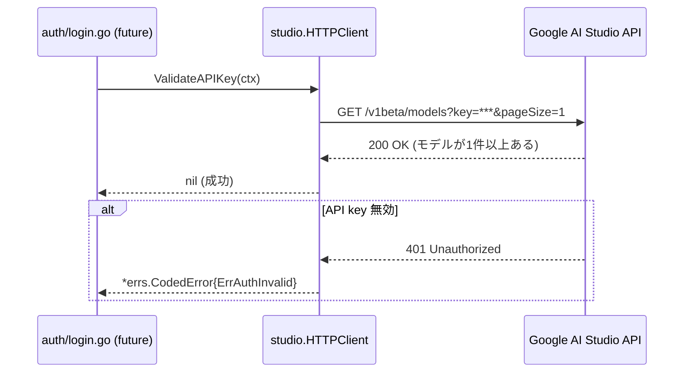

# マイルストーン M08: Studio API クライアント

## 概要

Google AI Studio REST API v1 の HTTP クライアント実装。画像生成・モデル一覧・API key 検証の3機能を pure Go で実装する。

## スコープ

### 実装範囲

- `internal/backend/studio/client.go` — StudioClient interface + HTTPClient struct
- `internal/backend/studio/types.go` — Request/Response 型定義
- `internal/backend/studio/generate.go` — Generate メソッド実装
- `internal/backend/studio/models.go` — ListModels メソッド実装
- `internal/backend/studio/errors.go` — HTTP ステータス/APIエラー → errs.ErrorCode マッピング
- `internal/backend/studio/ratelimit.go` — レスポンスヘッダ → RateLimit 解析
- テストファイル（各 `*_test.go`）

### スコープ外

- Vertex AI 対応
- SDK（google.golang.org/genai）は使わない — raw REST で実装
- fallback ロジック（M17 で実装）
- CLI コマンド統合（M11 以降）

---

## Google AI Studio API 仕様

### エンドポイント

> **注記**: Gemini API のエンドポイントパスは `/v1beta/` を使用する。imgraft の v1 リリースとは別のバージョニング体系であり、無関係。

```
# 画像生成（generateContent）
POST https://generativelanguage.googleapis.com/v1beta/models/{model}:generateContent?key={api_key}

# モデル一覧
GET https://generativelanguage.googleapis.com/v1beta/models?key={api_key}

# API key 検証（モデル一覧 + 制限付き呼び出し）
GET https://generativelanguage.googleapis.com/v1beta/models?key={api_key}&pageSize=1
```

### リクエスト形式（generateContent）

```json
{
  "contents": [
    {
      "role": "user",
      "parts": [
        { "text": "user prompt here" },
        {
          "inlineData": {
            "mimeType": "image/png",
            "data": "<base64>"
          }
        }
      ]
    }
  ],
  "systemInstruction": {
    "parts": [
      { "text": "system prompt here" }
    ]
  },
  "generationConfig": {
    "responseModalities": ["IMAGE", "TEXT"]
  }
}
```

### レスポンス形式（generateContent）

```json
{
  "candidates": [
    {
      "content": {
        "parts": [
          {
            "inlineData": {
              "mimeType": "image/png",
              "data": "<base64>"
            }
          }
        ]
      },
      "finishReason": "STOP"
    }
  ],
  "usageMetadata": {
    "promptTokenCount": 100,
    "candidatesTokenCount": 0
  }
}
```

### エラーレスポンス形式

```json
{
  "error": {
    "code": 429,
    "message": "Resource has been exhausted...",
    "status": "RESOURCE_EXHAUSTED"
  }
}
```

### レート制限ヘッダ

Gemini API が返す可能性のあるヘッダ（返さないこともある）:
- `x-ratelimit-limit-requests`
- `x-ratelimit-remaining-requests`
- `x-ratelimit-reset-requests`
- `Retry-After`（429 時）

---

## Go インターフェース設計

### StudioClient interface（SPEC.md 20.5）

```go
// StudioClient は Google AI Studio API のクライアントインターフェース。
type StudioClient interface {
    Generate(ctx context.Context, req GenerateRequest) (GenerateResponse, http.Header, error)
    ListModels(ctx context.Context) ([]RemoteModel, error)
    ValidateAPIKey(ctx context.Context) error
}
```

### Request/Response 型

```go
// GenerateRequest は Generate メソッドへの入力。
type GenerateRequest struct {
    Model         string
    Prompt        string
    SystemPrompt  string
    References    []ReferenceData  // 参照画像（Base64 + MimeType）
}

// ReferenceData は参照画像の内部表現。
type ReferenceData struct {
    MimeType string
    Data     []byte  // raw bytes (Base64エンコードは内部で行う)
}

// GenerateResponse は Generate メソッドの出力。
type GenerateResponse struct {
    ImageData []byte  // PNG bytes
    MimeType  string
}

// RemoteModel はモデル一覧エンドポイントから取得したモデル情報。
type RemoteModel struct {
    Name                string
    DisplayName         string
    SupportedGeneration bool
}
```

### HTTPClient 実装型

```go
// HTTPClient は StudioClient の HTTP 実装。
type HTTPClient struct {
    apiKey     string
    baseURL    string  // テスト時にオーバーライド可能
    httpClient *http.Client
}

// New は HTTPClient を生成する。
func New(apiKey string) *HTTPClient

// NewWithBaseURL はベース URL を指定して HTTPClient を生成する（テスト用）。
func NewWithBaseURL(apiKey, baseURL string, httpClient *http.Client) *HTTPClient
```

---

## テスト設計書

### 正常系テストケース

| ID | テスト対象 | 入力 | 期待出力 | 備考 |
|----|-----------|------|---------|------|
| T01 | `Generate` 正常系 | model="flash", prompt="test", refs=nil | GenerateResponse{ImageData: pngBytes}, Header, nil | httptest.Server で mock |
| T02 | `Generate` with refs | refs=[{png, bytes}] | GenerateResponse, Header, nil | inlineData が含まれること |
| T03 | `Generate` with system prompt | systemPrompt="..." | リクエスト body に systemInstruction が含まれること | |
| T04 | `ListModels` 正常系 | — | []RemoteModel{...} | モデル2件以上のレスポンス |
| T05 | `ValidateAPIKey` 正常系 | — | nil | 200 OK |
| T06 | `parseRateLimit` Retry-After あり | header{"Retry-After": "30"} | RateLimit{RetryAfterSeconds: &30} | |
| T07 | `parseRateLimit` ヘッダなし | header{} | RateLimit{全フィールド nil（Provider 除く）} | |
| T08 | `parseRateLimit` requests-limit あり | header{"x-ratelimit-limit-requests": "60"} | RateLimit{RequestsLimit: &60} | |

### 異常系テストケース

| ID | テスト対象 | 入力/状況 | 期待エラー | 備考 |
|----|-----------|----------|----------|------|
| T09 | `Generate` 429 | server returns 429 + Retry-After: 10 | errs.ErrRateLimitExceeded | |
| T10 | `Generate` 401/403 | server returns 403 | errs.ErrAuthInvalid | |
| T11 | `Generate` 400 | server returns 400 | errs.ErrInvalidArgument | |
| T12 | `Generate` 503 | server returns 503 | errs.ErrBackendUnavailable | |
| T13 | `Generate` 500 | server returns 500 | errs.ErrInternal | |
| T14 | `Generate` ネットワークエラー | context.Canceled | errs.ErrBackendUnavailable | ctx cancel |
| T15 | `Generate` タイムアウト | context.DeadlineExceeded | errs.ErrBackendUnavailable | |
| T16 | `Generate` 画像なしレスポンス | candidates に inlineData なし | errs.ErrInternal | |
| T17 | `ValidateAPIKey` 401 | server returns 401 | errs.ErrAuthInvalid | |
| T18 | `mapHTTPStatus` 各ステータス | 400/401/403/404/429/500/503 | 対応するエラーコード | テーブル駆動 |

### エッジケース

| ID | テスト対象 | 状況 | 期待動作 |
|----|-----------|------|---------|
| T19 | `Generate` | API key 空文字 | 構築時ではなくリクエスト時にエラー（API側 401） |
| T20 | `parseRateLimit` | Retry-After に非数値 "abc" | RetryAfterSeconds: nil (無視) |
| ~~T21~~ | 削除（nil context は Go 慣習違反。パニックで良い） | — | — |
| T22 | `ListModels` | 空リスト | []RemoteModel{} (nil でない) |
| T23 | `Generate` | candidatesが空配列 | errs.ErrInternal |

---

## 実装手順

### Step 1: ディレクトリ・ファイル骨格作成（Red準備）

- `internal/backend/studio/` ディレクトリ作成
- 各ファイルの `package studio` 宣言のみ作成

**ファイル一覧:**
```
internal/backend/studio/
  client.go       — interface + HTTPClient struct + New()
  types.go        — GenerateRequest, GenerateResponse, RemoteModel, ReferenceData
  generate.go     — Generate() + doRequest() 内部実装
  models.go       — ListModels() + ValidateAPIKey()
  errors.go       — mapHTTPStatus(), mapAPIError() + APIError 型
  ratelimit.go    — parseRateLimit()
  client_test.go  — Generate/ListModels/ValidateAPIKey テスト
  errors_test.go  — mapHTTPStatus テーブル駆動テスト
  ratelimit_test.go — parseRateLimit テスト
```

### Step 2: types.go 実装

依存関係: なし

```go
package studio

import (
    "context"
    "net/http"
)

type StudioClient interface {
    Generate(ctx context.Context, req GenerateRequest) (GenerateResponse, http.Header, error)
    ListModels(ctx context.Context) ([]RemoteModel, error)
    ValidateAPIKey(ctx context.Context) error
}

type GenerateRequest struct { ... }
type ReferenceData struct { ... }
type GenerateResponse struct { ... }
type RemoteModel struct { ... }

// API リクエスト/レスポンスの内部 JSON 型（非公開）
type generateContentRequest struct { ... }
type generateContentResponse struct { ... }
type listModelsResponse struct { ... }
type apiErrorResponse struct { ... }
```

### Step 3: errors.go 実装（Red → Green）

**テスト先行 (Red):**
```go
// errors_test.go
func TestMapHTTPStatus(t *testing.T) {
    cases := []struct{
        code int
        want errs.ErrorCode
    }{
        {400, errs.ErrInvalidArgument},
        {401, errs.ErrAuthInvalid},
        {403, errs.ErrAuthInvalid},  // PERMISSION_DENIED相当
        {404, errs.ErrBackendUnavailable},
        {429, errs.ErrRateLimitExceeded},
        {500, errs.ErrInternal},
        {503, errs.ErrBackendUnavailable},
    }
    // ...
}
```

**実装 (Green):**
```go
// errors.go
func mapHTTPStatus(statusCode int, body []byte) *errs.CodedError {
    // body を apiErrorResponse にパースして詳細を取得
    // status コードで errs.ErrorCode にマッピング
}
```

### Step 4: ratelimit.go 実装（Red → Green）

**テスト先行 (Red):**
```go
// ratelimit_test.go
func TestParseRateLimit(t *testing.T) {
    // T06, T07, T08, T20 のテストケースを先に書く
}
```

**実装 (Green):**
```go
// ratelimit.go
// RateLimit は SPEC.md 20.3 の型（internal/ratelimit パッケージと重複しないよう注意）
// M08 では studio パッケージ内の関数として parseRateLimit を実装し、
// 結果は map[string]interface{} または専用の struct で返す
func parseRateLimit(header http.Header, provider string) RateLimitInfo { ... }
```

> **設計注記**: M16 で `internal/ratelimit` パッケージを別途実装予定。
> M08 では studio パッケージ内に閉じた形で先行実装し、M16 でリファクタリング（移動）する。

### Step 5: client.go + generate.go 実装（Red → Green）

**テスト先行 (Red):**
```go
// client_test.go
func TestGenerate_Success(t *testing.T) {
    srv := httptest.NewServer(http.HandlerFunc(func(w http.ResponseWriter, r *http.Request) {
        // モックレスポンスを返す
        json.NewEncoder(w).Encode(generateContentResponse{...})
    }))
    defer srv.Close()

    client := NewWithBaseURL("test-api-key", srv.URL, http.DefaultClient)
    resp, header, err := client.Generate(context.Background(), GenerateRequest{...})
    // アサーション
}
```

**実装 (Green):**

`generate.go` — Generate メソッド:
1. `GenerateRequest` → `generateContentRequest` JSON 変換
2. `POST {baseURL}/v1beta/models/{model}:generateContent?key={apiKey}` リクエスト送信
3. レスポンスの HTTP ステータス確認 → エラーマッピング
4. `candidates[0].content.parts` から `inlineData` を抽出
5. Base64 デコード → `GenerateResponse.ImageData`
6. `http.Header` をそのまま返す — RateLimit 解析は上位層（M11 の app/run.go）が M16 の `ratelimit.Parse()` を通じて行う責務を持つ。studio パッケージは HTTP レイヤーに閉じ、raw header を返すにとどめる

### Step 6: models.go 実装（Red → Green）

`ListModels`:
1. `GET {baseURL}/v1beta/models?key={apiKey}` リクエスト送信
2. レスポンスを `listModelsResponse` にデコード
3. `supportedGenerationMethods` に `"generateContent"` または `"generateImages"` が含まれるモデルのみ `SupportedGeneration: true` にする
4. `[]RemoteModel` を返す

`ValidateAPIKey`:
1. `GET {baseURL}/v1beta/models?key={apiKey}&pageSize=1` リクエスト送信
2. 200 OK → nil
3. エラー → `mapHTTPStatus()` の結果を返す

### Step 7: Refactor

- `doRequest()` ヘルパー関数に共通処理（JSON エンコード/デコード、エラーハンドリング）を抽出
- Base64 エンコード処理を `encodeReferenceData()` に分離
- テストのヘルパー関数（`makeTestServer()`）を整理

### Step 8: テスト実行・確認

```bash
cd /Users/youyo/src/github.com/youyo/imgraft
go test ./internal/backend/studio/... -v
go vet ./...
```

---

## アーキテクチャ検討

### 既存パターンとの整合性

| 観点 | 方針 |
|------|------|
| パッケージ名 | `studio`（`backend/studio` 配下） |
| エラー処理 | `errs.CodedError` を使用（M04 パターン踏襲） |
| テストファイル命名 | `*_test.go`（package studio） |
| 公開インターフェース | `StudioClient` interface + `HTTPClient` 実装分離 |
| HTTP client | `*http.Client` を注入可能にしてテスタビリティ確保 |

### 外部 SDK を使わない理由

- `google.golang.org/genai` SDK は image generation API の Go サポートが限定的
- pure Go で REST を叩く方が依存が少なく、SPEC.md の「外部コマンド依存なし」精神に合う
- `go.mod` に新しい依存を追加しない（`net/http` のみで実装）

### RateLimit の設計方針（M16 との関係）

```
M08: studio パッケージ内に RateLimitInfo 型を一時的に定義
M16: internal/ratelimit パッケージを実装後、M08 の parseRateLimit を移動・リファクタリング
```

M08 では `studio.RateLimitInfo` を内部型として使い、Generate の戻り値は `http.Header` のまま返す。
上位層（M11 以降の app/run.go）が M16 の `ratelimit.Parse()` を呼び出す設計。

---

## リスク評価

| リスク | 重大度 | 対策 |
|--------|--------|------|
| API のエンドポイント URL が変わる | 中 | `baseURL` 定数を `const BaseURL` として分離、変更容易に |
| generateContent のレスポンス形式が変わる | 中 | `candidates[0]` の存在確認を必ず行う |
| Base64 デコード失敗（壊れた画像データ） | 中 | `base64.StdEncoding.DecodeString` のエラーを `errs.ErrInternal` にマップ |
| コンテキストキャンセル時の不完全なレスポンス | 低 | `ctx` を `http.NewRequestWithContext` に渡す |
| `httptest.Server` テストでのポート競合 | 低 | `httptest.NewServer` は自動割り当て、問題なし |
| M16 実装前の RateLimit 型二重定義 | 低 | M08 では studio 内部型として明示的にコメント付記 |
| go get が TLS 証明書エラー | 低 | 新依存なし（`net/http` のみ）、GOPROXY 不要 |

---

## シーケンス図

### 正常系: 画像生成フロー



### エラー系: 429 Too Many Requests



### エラー系: ネットワークエラー / タイムアウト



### ValidateAPIKey フロー



---

## チェックリスト

### 観点1: 実装実現可能性（5項目）

- [x] 手順の抜け漏れがないか（Step 1-8 で端から端まで網羅）
- [x] 各ステップが十分に具体的か（ファイル名・関数名・処理内容を明示）
- [x] 依存関係が明示されているか（types.go → errors.go → client.go の順序）
- [x] 変更対象ファイルが網羅されているか（6ファイル + 3テストファイル）
- [x] 影響範囲が正確に特定されているか（internal/backend/studio のみ、外部影響なし）

### 観点2: TDDテスト設計の品質（6項目）

- [x] 正常系テストケースが網羅されているか（T01-T08: 8件）
- [x] 異常系テストケースが定義されているか（T09-T18: 10件）
- [x] エッジケースが考慮されているか（T19-T23: 5件）
- [x] 入出力が具体的に記述されているか（テーブル形式で具体的なデータ値）
- [x] Red→Green→Refactorの順序が守られているか（Step 3/4/5 で明示）
- [x] モック/スタブの設計が適切か（httptest.Server を使用）

### 観点3: アーキテクチャ整合性（5項目）

- [x] 既存の命名規則に従っているか（errs パッケージと同様の構造）
- [x] 設計パターンが一貫しているか（interface + 実装型の分離）
- [x] モジュール分割が適切か（責務が明確: types/generate/models/errors/ratelimit）
- [x] 依存方向が正しいか（studio → errs の一方向、循環なし）
- [x] 類似機能との統一性があるか（errs.CodedError のエラーパターン踏襲）

### 観点4: リスク評価と対策（6項目）

- [x] リスクが適切に特定されているか（7項目のリスク評価）
- [x] 対策が具体的か（各リスクに具体的な実装対策を明記）
- [x] フェイルセーフが考慮されているか（candidates 存在確認、base64 デコードエラー処理）
- [x] パフォーマンスへの影響が評価されているか（HTTP client は呼び出し側で管理）
- [x] セキュリティ観点が含まれているか（API key はログに出さない、URL クエリで渡す）
- [x] ロールバック計画があるか（ファイル追加のみ、既存コードへの影響なし）

### 観点5: シーケンス図の完全性（5項目）

- [x] 正常フローが記述されているか（Generate 正常系）
- [x] エラーフローが記述されているか（429, ネットワークエラー）
- [x] ユーザー・システム・外部API間の相互作用が明確か
- [x] タイミング・同期的な処理の制御が明記されているか
- [x] リトライ・タイムアウト等の例外ハンドリングが図に含まれているか

---

## ドキュメント更新

- `README.md`: M08 完了後も未作成のため対象外（M21 で実装）
- `docs/specs/SPEC.md`: 仕様変更なし
- `plans/imgraft-roadmap.md`: M08 チェックボックスを完了マークにする

---

## Next Action

> **このプランが承認されました。以下を順番に実行してください:**
>
> 1. `Skill(devflow:implement)` — このプランに基づいて実装を開始
>
> ユーザーの追加指示は不要です。即座に実行してください。
