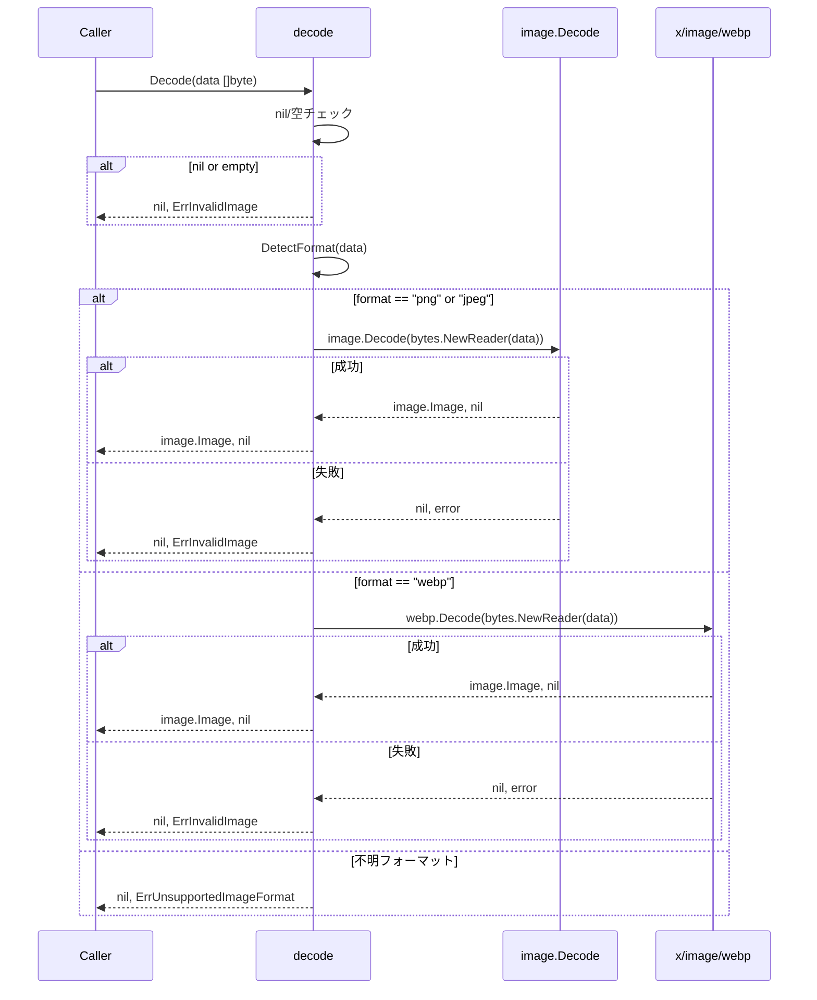
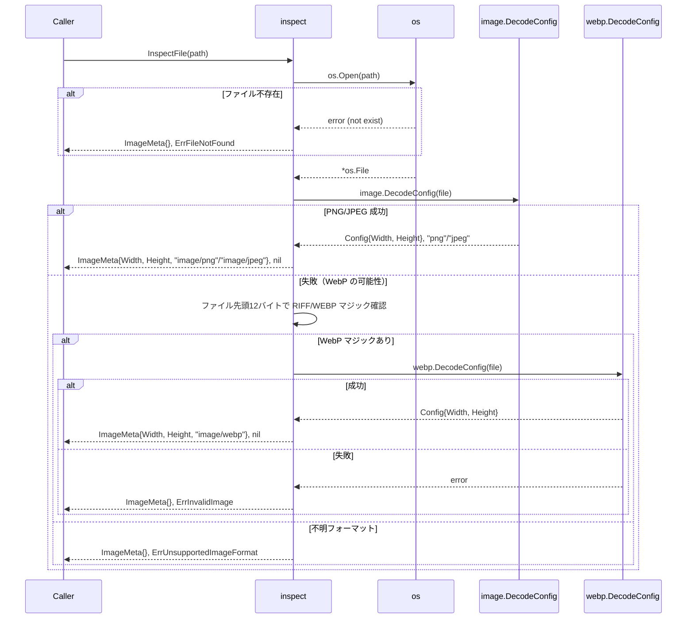
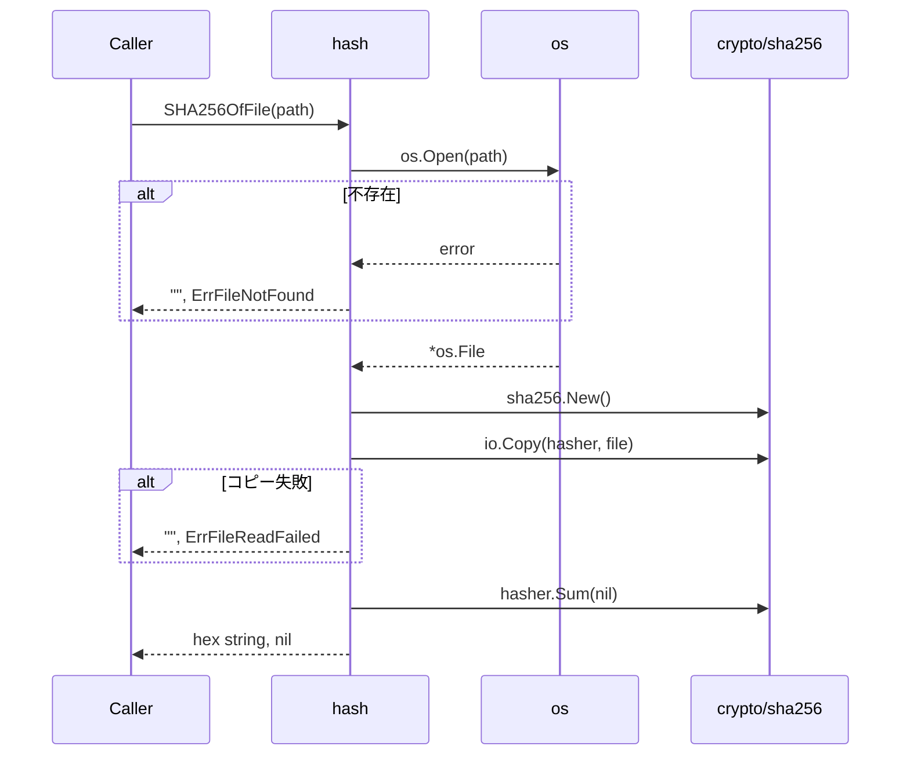

# マイルストーン M09: 画像デコード・エンコード

## 概要

`internal/imageproc/` パッケージに PNG/JPEG/WebP デコード、PNG エンコード（alpha チャネル対応）、SHA256 ハッシュ計算、画像メタデータ inspect を pure Go で実装する。

## スコープ

### 実装範囲

- `internal/imageproc/decode.go` — PNG/JPEG/WebP デコード
- `internal/imageproc/encode.go` — PNG エンコード（alpha チャネル対応）
- `internal/imageproc/hash.go` — SHA256 ハッシュ計算
- `internal/imageproc/inspect.go` — 画像メタデータ取得（width, height, mime_type）
- `internal/imageproc/decode_test.go` — decode のテスト
- `internal/imageproc/encode_test.go` — encode のテスト
- `internal/imageproc/hash_test.go` — hash のテスト
- `internal/imageproc/inspect_test.go` — inspect のテスト
- `go.mod` / `go.sum` — golang.org/x/image 依存追加

### スコープ外

- 背景除去処理（M14 で実装）
- trim 処理（M15 で実装）
- ファイル保存処理（M10 で実装）
- 参照画像の検証（M12 で実装）

## 依存関係前提条件

- M01（runtime パッケージ）: 完了済み
- M04（errs パッケージ）: 完了済み（`errs.New`, `errs.Wrap`, `errs.CodedError` が利用可能）
- golang.org/x/image: `go get` による追加が必要

### golang.org/x/image の取得

ネットワーク環境によっては TLS エラーが発生するため、以下の優先順で試みる:

```bash
# 優先: 標準
go get golang.org/x/image@latest

# TLS エラーの場合
GOPROXY=direct go get golang.org/x/image@latest

# それでも失敗する場合（サンドボックス環境）
# 実装者は vendor または replace ディレクティブを検討する
```

**重要**: `golang.org/x/image/webp` は WebP デコードのみで、エンコードは非対応。WebP → image.Image → PNG の変換に使用する。

---

## テスト設計書（TDD: Red → Green → Refactor）

### decode.go のテスト設計

#### 正常系ケース

| ID | 入力 | 期待出力 | 備考 |
|----|------|---------|------|
| D-01 | 有効な PNG bytes | `(image.Image, nil)` | 幅・高さが正しいこと |
| D-02 | 有効な JPEG bytes | `(image.Image, nil)` | 幅・高さが正しいこと |
| D-03 | 有効な WebP bytes | `(image.Image, nil)` | golang.org/x/image/webp 使用 |
| D-04 | alpha チャネル付き PNG bytes | `(image.Image, nil)` | NRGBA/RGBA 型が返る |

#### 異常系ケース

| ID | 入力 | 期待エラー | 備考 |
|----|------|-----------|------|
| D-E01 | nil bytes | `errs.ErrInvalidImage` | |
| D-E02 | 空 bytes (`[]byte{}`) | `errs.ErrInvalidImage` | |
| D-E03 | 破損したバイナリ | `errs.ErrInvalidImage` | |
| D-E04 | サポート外フォーマット (GIF) | `errs.ErrUnsupportedImageFormat` | |
| D-E05 | PNG ヘッダだが内容が壊れた bytes | `errs.ErrInvalidImage` | |

#### エッジケース

| ID | 入力 | 期待出力 | 備考 |
|----|------|---------|------|
| D-Edge01 | 1x1 PNG | `(image.Image, nil)` | 最小サイズ |
| D-Edge02 | マジックバイトのみの切り詰めデータ | `errs.ErrInvalidImage` | |

---

### encode.go のテスト設計

#### 正常系ケース

| ID | 入力 | 期待出力 | 備考 |
|----|------|---------|------|
| E-01 | 不透明 image.Image（RGBA） | PNG bytes（alpha=255）、nil | |
| E-02 | 透明ピクセル含む image.NRGBA | PNG bytes（alpha チャネル保持）、nil | |
| E-03 | 1x1 完全透明 image.NRGBA | PNG bytes（alpha=0）、nil | |
| E-04 | 4096x4096 NRGBA | PNG bytes、nil | 大きいサイズ |

#### 異常系ケース

| ID | 入力 | 期待エラー | 備考 |
|----|------|-----------|------|
| E-E01 | nil image | `errs.ErrInternal` | |

#### 検証方法

エンコードした bytes を再デコードして画素値を比較する（ラウンドトリップテスト）。

---

### hash.go のテスト設計

#### 正常系ケース

| ID | 入力 | 期待出力 | 備考 |
|----|------|---------|------|
| H-01 | 固定 bytes（`"hello"` など） | 既知 SHA256 hex string | Goldenテスト |
| H-02 | 空 bytes `[]byte{}` | SHA256 of empty (`e3b0c4...`) | |
| H-03 | ファイルパスから計算 | 固定ファイルの既知ハッシュ | ファイル読み込みテスト |

#### 異常系ケース

| ID | 入力 | 期待エラー | 備考 |
|----|------|-----------|------|
| H-E01 | 存在しないファイルパス | `errs.ErrFileNotFound` | |
| H-E02 | 読み込み不能なファイル | `errs.ErrFileReadFailed` | パーミッション変更でシミュレート |

---

### inspect.go のテスト設計

#### 正常系ケース

| ID | 入力 | 期待出力 | 備考 |
|----|------|---------|------|
| I-01 | 32x24 PNG ファイルパス | `{Width:32, Height:24, MimeType:"image/png"}` | |
| I-02 | 100x50 JPEG ファイルパス | `{Width:100, Height:50, MimeType:"image/jpeg"}` | |
| I-03 | WebP ファイルパス | `{Width:N, Height:M, MimeType:"image/webp"}` | |
| I-04 | alpha 付き PNG | `{Width:N, Height:M, MimeType:"image/png"}` | |

#### 異常系ケース

| ID | 入力 | 期待エラー | 備考 |
|----|------|-----------|------|
| I-E01 | 存在しないパス | `errs.ErrFileNotFound` | |
| I-E02 | 破損ファイル | `errs.ErrInvalidImage` | |
| I-E03 | GIF ファイル | `errs.ErrUnsupportedImageFormat` | |

---

## 実装手順

### Step 0: golang.org/x/image 依存追加

```bash
cd /Users/youyo/src/github.com/youyo/imgraft
go get golang.org/x/image@latest
# TLS エラーの場合:
# GOPROXY=direct go get golang.org/x/image@latest
```

**依存**: なし（最初に実行）

---

### Step 1: [RED] テストファイルを先に作成

`internal/imageproc/` ディレクトリを作成し、テストファイルを先に書く。

テスト用のヘルパー関数:
- `mustMakePNG(w, h int, withAlpha bool) []byte` — テスト用 PNG bytes 生成
- `mustMakeJPEG(w, h int) []byte` — テスト用 JPEG bytes 生成
- `mustMakeWebP(w, h int) []byte` — WebP テスト用（可能なら）

この時点でテストは **コンパイルエラー**（実装が存在しないため）。

---

### Step 2: [RED → GREEN] decode.go の実装

**ファイル**: `internal/imageproc/decode.go`

```go
package imageproc

import (
    "bytes"
    "image"
    _ "image/jpeg"
    _ "image/png"
    "io"

    "golang.org/x/image/webp"
    "github.com/youyo/imgraft/internal/errs"
)

// Decode は PNG/JPEG/WebP の bytes を image.Image にデコードする。
// フォーマット不明・デコード失敗時は errs.CodedError を返す。
func Decode(data []byte) (image.Image, error)

// DetectFormat は bytes のマジックバイトからフォーマットを判定する。
// 戻り値: "png" | "jpeg" | "webp" | ""
func DetectFormat(data []byte) string
```

**実装方針**:
1. `DetectFormat` でマジックバイト判定（`image.DecodeConfig` や bytes prefix チェック）
2. PNG/JPEG は `image.Decode` で処理（`_ "image/jpeg"` / `_ "image/png"` をブランクインポート）
3. WebP は `golang.org/x/image/webp.Decode` で処理
4. `""` / nil / 破損データ → `errs.ErrInvalidImage`
5. GIF 等サポート外 → `errs.ErrUnsupportedImageFormat`

**依存**: golang.org/x/image（Step 0 完了後）

---

### Step 3: [RED → GREEN] encode.go の実装

**ファイル**: `internal/imageproc/encode.go`

```go
package imageproc

import (
    "bytes"
    "image"
    "image/png"

    "github.com/youyo/imgraft/internal/errs"
)

// EncodePNG は image.Image を PNG bytes にエンコードする。
// alpha チャネルを保持する（NRGBA/RGBA はそのまま PNG に収まる）。
func EncodePNG(img image.Image) ([]byte, error)
```

**実装方針**:
1. `bytes.Buffer` に `png.Encode` で書き込む
2. nil image → `errs.ErrInternal`
3. encode エラー → `errs.ErrInternal` でラップ
4. alpha は `image/png` が自動で保持する（NRGBA → RGBA PNG）

---

### Step 4: [RED → GREEN] hash.go の実装

**ファイル**: `internal/imageproc/hash.go`

```go
package imageproc

import (
    "crypto/sha256"
    "fmt"
    "io"
    "os"

    "github.com/youyo/imgraft/internal/errs"
)

// SHA256OfBytes は bytes の SHA256 を hex string で返す。
func SHA256OfBytes(data []byte) string

// SHA256OfFile はファイルパスを受け取り、SHA256 hex string を返す。
// ファイル読み込みエラーは errs.CodedError を返す。
func SHA256OfFile(path string) (string, error)
```

**実装方針**:
1. `SHA256OfBytes`: `crypto/sha256` で計算、`fmt.Sprintf("%x", ...)` で hex 変換
2. `SHA256OfFile`: ファイル open → streaming sha256 計算（`io.Copy`）、ファイル不存在 → `errs.ErrFileNotFound`
3. ファイル読み込みエラー → `errs.ErrFileReadFailed`

---

### Step 5: [RED → GREEN] inspect.go の実装

**ファイル**: `internal/imageproc/inspect.go`

```go
package imageproc

import (
    "image"
    _ "image/jpeg"
    _ "image/png"
    "os"

    "golang.org/x/image/webp"
    "github.com/youyo/imgraft/internal/errs"
)

// ImageMeta は画像のメタデータを表す。
type ImageMeta struct {
    Width    int
    Height   int
    MimeType string
}

// InspectFile はファイルパスから ImageMeta を取得する。
// デコードせずに image.DecodeConfig を使用して軽量に読み込む。
func InspectFile(path string) (ImageMeta, error)

// InspectBytes は bytes から ImageMeta を取得する。
func InspectBytes(data []byte) (ImageMeta, error)
```

**実装方針**:
1. `image.DecodeConfig` で幅・高さのみを取得（全デコード不要）
2. WebP は `golang.org/x/image/webp.DecodeConfig` を使用
3. `mime_type` はフォーマット文字列から変換: `"png"` → `"image/png"`, `"jpeg"` → `"image/jpeg"`, `"webp"` → `"image/webp"`
4. サポート外 → `errs.ErrUnsupportedImageFormat`
5. 破損ファイル → `errs.ErrInvalidImage`
6. ファイル不存在 → `errs.ErrFileNotFound`

---

### Step 6: [GREEN] 全テスト確認

```bash
go test ./internal/imageproc/...
```

全テスト GREEN を確認。

---

### Step 7: [REFACTOR] コードレビュー・整理

- 重複コードの抽出（例: ファイルオープン処理）
- `DetectFormat` の共通化（decode.go と inspect.go で重複する場合）
- エラーメッセージの一貫性確認
- godoc コメントの整備

---

### Step 8: コミット

```bash
git add internal/imageproc/ go.mod go.sum
git commit -m "feat(imageproc): M09 画像デコード・エンコードパッケージを実装"
```

---

## アーキテクチャ検討

### 既存パターンとの整合性

- パッケージ名: `imageproc`（ディレクトリ名と一致）
- エラー: `errs.New` / `errs.Wrap` で `*errs.CodedError` を返す（M04 パターン準拠）
- テスト: `package imageproc_test`（外部テストパッケージ）を基本とし、内部のみ `package imageproc`

### フォーマット判定の設計

`image.DecodeConfig` はマジックバイトからフォーマットを返す。WebP は `_ "image/jpeg"` 等の登録がないため、別途 `golang.org/x/image/webp.DecodeConfig` を呼ぶ。

**フォーマット判定ロジック:**

```
1. bytes が nil/空 → ErrInvalidImage
2. image.DecodeConfig(bytes) 試行
   - 成功 → format 文字列を使用（"png", "jpeg"）
   - 失敗 → マジックバイトで WebP を確認 (RIFF....WEBP)
     - WebP なら webp.DecodeConfig 試行
     - 失敗/非WebP → 他フォーマット or 破損
3. サポート外フォーマット → ErrUnsupportedImageFormat
4. デコード失敗 → ErrInvalidImage
```

### ライブラリ選定

| 機能 | ライブラリ | 理由 |
|------|-----------|------|
| PNG デコード/エンコード | 標準 `image/png` | 標準ライブラリで十分 |
| JPEG デコード | 標準 `image/jpeg` | 標準ライブラリで十分 |
| WebP デコード | `golang.org/x/image/webp` | pure Go の WebP デコーダ（公式 x/image） |
| SHA256 | 標準 `crypto/sha256` | 標準ライブラリで十分 |

---

## シーケンス図

### Decode フロー



### InspectFile フロー



### SHA256OfFile フロー



---

## リスク評価

| リスク | 重大度 | 対策 |
|--------|--------|------|
| golang.org/x/image の go get が TLS エラー | 高 | `GOPROXY=direct` を試す。サンドボックス環境では vendor 対応を検討 |
| WebP エンコード非対応（x/image は decode のみ） | 中 | 出力は常に PNG のため問題なし。WebP 参照画像の変換先は image.Image で統一 |
| image.DecodeConfig が WebP を認識しない | 中 | WebP は標準 image パッケージに登録されていない。マジックバイト手動チェックで対応 |
| 大容量画像（4096x4096）のメモリ使用 | 中 | inspect 時は `image.DecodeConfig` を使い全デコードを避ける |
| Go 1.26 での標準ライブラリ互換性 | 低 | image/png, image/jpeg は安定 API。x/image も後方互換性あり |

---

## チェックリスト（5観点27項目）

### 観点1: 実装実現可能性と完全性

- [x] 手順の抜け漏れがないか（Step 0〜8 で端から端まで）
- [x] 各ステップが十分に具体的か（ファイル名・関数名・実装方針を明記）
- [x] 依存関係が明示されているか（Step 0 が最初、各 Step に依存を記載）
- [x] 変更対象ファイルが網羅されているか（decode/encode/hash/inspect + テスト + go.mod）
- [x] 影響範囲が正確に特定されているか（M14/M15/M12 との境界を明記）

### 観点2: TDDテスト設計の品質

- [x] 正常系テストケースが網羅されているか（各ファイル3〜4ケース）
- [x] 異常系テストケースが定義されているか（各ファイル2〜3ケース）
- [x] エッジケースが考慮されているか（nil/空/1x1等）
- [x] 入出力が具体的に記述されているか（ID付きテーブルで記述）
- [x] Red→Green→Refactorの順序が守られているか（Step 1→2〜5→6→7）
- [x] モック/スタブの設計が適切か（テスト用ヘルパー関数で bytes 生成）

### 観点3: アーキテクチャ整合性

- [x] 既存の命名規則に従っているか（errs.New/Wrap, package imageproc）
- [x] 設計パターンが一貫しているか（errs.CodedError パターン）
- [x] モジュール分割が適切か（decode/encode/hash/inspect の4責務）
- [x] 依存方向が正しいか（imageproc → errs のみ、循環なし）
- [x] 類似機能との統一性があるか（runtime パターンのテスト形式を踏襲）

### 観点4: リスク評価と対策

- [x] リスクが適切に特定されているか（TLS/WebP/メモリ等5件）
- [x] 対策が具体的か（GOPROXY=direct, vendor, マジックバイト手動チェック等）
- [x] フェイルセーフが考慮されているか（エラー時は errs.CodedError で安全に返す）
- [x] パフォーマンスへの影響が評価されているか（inspect は DecodeConfig で軽量化）
- [x] セキュリティ観点が含まれているか（任意 bytes のデコード → エラー時も panic なし）
- [x] ロールバック計画があるか（go.mod の依存追加は go mod tidy で戻せる）

### 観点5: シーケンス図の完全性

- [x] 正常フローが記述されているか（Decode/InspectFile/SHA256OfFile）
- [x] エラーフローが記述されているか（各図でエラー経路を記述）
- [x] ユーザー・システム・外部API間の相互作用が明確か（Caller/imageproc/stdlib/x/image）
- [x] タイミング・同期的な処理の制御が明記されているか（全て同期処理）
- [x] リトライ・タイムアウト等の例外ハンドリングが図に含まれているか（N/A: 画像処理はリトライ不要）

---

## レビュー修正メモ（advocate レビュー 2026-03-28）

1. **InspectFile/InspectBytes のシーク問題**: `io.ReadAll` + `bytes.NewReader` 方式で解決。ファイルポインタリセット不要にする。
2. **WebP テストバイナリ**: `mustMakeWebP` は最小有効WebPバイナリのハードコード、または `testdata/1x1.webp` ファイルを配置して対応。
3. **go get フォールバック**: `go get` → `GOPROXY=direct` → 手動対応の3段階。

---

## ドキュメント更新

- `docs/specs/SPEC.md`: M09 の実装対応として imageproc パッケージの存在が確認される（更新不要）
- `plans/imgraft-roadmap.md`: M09 完了チェックボックスを更新（実装後）
- `README.md`: v1 完成前のため未更新（M21 で対応）

---

## Next Action

> **このプランが承認されました。以下を順番に実行してください:**
>
> 1. `Skill(devflow:implement)` — このプランに基づいて実装を開始
>
> ユーザーの追加指示は不要です。即座に実行してください。
