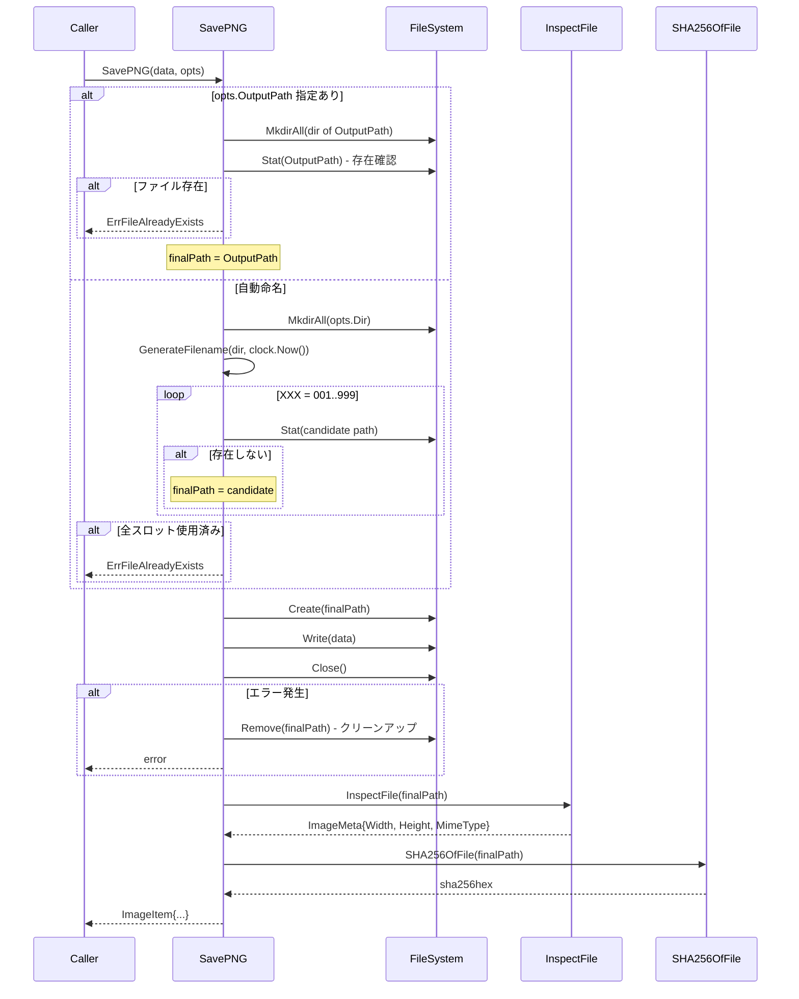

# M10: ファイル出力 - 詳細実装計画

## 概要

| 項目 | 値 |
|------|---|
| マイルストーン | M10 - ファイル出力 |
| スコープ | `internal/output/naming.go`, `internal/output/save.go`, unit test |
| 依存 | M04 (errs), M05 (output types), M01 (runtime.Clock), M09 (imageproc) |
| アプローチ | TDD: Red → Green → Refactor |
| 作成日 | 2026-03-28 |

---

## 1. スコープと責務

### 1.1 naming.go
- ファイル名自動生成: `imgraft-YYYYMMDD-HHMMSS-XXX.png`
- 衝突回避: 同名ファイル存在時に連番インクリメント
- Clock injection によるテスト容易性

### 1.2 save.go
- write → close → inspect → sha256 のパイプライン
- ディレクトリ自動作成
- エラー時の部分書き込みファイル削除（クリーンアップ）
- ImageItem の組み立て

---

## 2. 公開API設計

### 2.1 naming.go

```go
package output

import (
    "fmt"
    "os"
    "path/filepath"
    "time"
)

// GenerateFilename は現在時刻に基づいて自動命名ファイル名を生成する。
// フォーマット: imgraft-YYYYMMDD-HHMMSS-XXX.png
// 同名ファイルが存在する場合は連番をインクリメントして回避する。
// dir が存在しない場合はエラーを返さず（save.goが作成する）。
func GenerateFilename(dir string, t time.Time) (string, error)

// resolveFilePath は最終的なファイルパスを計算する。
// 連番は001から始まり最大999まで（それ以上はErrFileAlreadyExists）。
func resolveFilePath(dir string, t time.Time) (string, error)
```

### 2.2 save.go

```go
package output

import (
    "github.com/youyo/imgraft/internal/imageproc"
    "github.com/youyo/imgraft/internal/runtime"
)

// SaveOptions はファイル保存の設定を保持する。
type SaveOptions struct {
    // OutputPath: --output フラグで指定された場合のパス（空の場合は自動命名）
    OutputPath string
    // Dir: 出力ディレクトリ（OutputPath が空の場合に使用）
    Dir string
    // Clock: 自動命名用の時刻プロバイダー（nil の場合は SystemClock）
    Clock runtime.Clock
    // Index: images 配列内のインデックス
    Index int
    // TransparentApplied: 透明処理が適用されたか
    TransparentApplied bool
}

// SavePNG はバイト列をPNGファイルとして保存し、ImageItem を返す。
// パイプライン: write → close → inspect → sha256
// エラー時は書き込み済みファイルを削除する（中途半端な状態を残さない）。
func SavePNG(data []byte, opts SaveOptions) (ImageItem, error)
```

---

## 3. 実装詳細

### 3.1 ファイル命名アルゴリズム

```
imgraft-YYYYMMDD-HHMMSS-XXX.png

YYYYMMDD = t.Format("20060102")
HHMMSS   = t.Format("150405")
XXX      = 3桁ゼロ埋め連番 (001, 002, ...)
```

衝突回避:
1. XXX=001 でパスを試す
2. `os.Stat(path)` でファイル存在確認
3. 存在しなければそのパスを返す
4. 存在すれば XXX をインクリメントして繰り返す
5. XXX が 999 を超えたら `ErrFileAlreadyExists` を返す

### 3.2 SavePNG パイプライン

```
1. ディレクトリ確保 (os.MkdirAll)
2. 最終ファイルパス決定
   - opts.OutputPath 指定あり → そのまま使用（ディレクトリ部分も作成）
   - 指定なし → GenerateFilename(opts.Dir, clock.Now())
3. os.Create でファイルを開く
4. data を書き込む (f.Write)
5. f.Close()
6. imageproc.InspectFile(path) でメタデータ取得
7. imageproc.SHA256OfFile(path) でハッシュ計算
8. ImageItem を組み立てて返す

エラーハンドリング:
- ステップ3以降でエラー → os.Remove(path) で部分ファイル削除
- ErrOutputDirCreateFailed, ErrFileWriteFailed, ErrInvalidOutputPath を使用
```

### 3.3 OutputPath の扱い

- `--output` 指定時は衝突チェックを行わない（SPECに--overwriteなしとあるが、--output指定は明示的なパス指定のため上書き確認はv1スコープ外）
  - 実際には `os.Create` が既存ファイルを上書きするが、SPECの「v1では--overwriteを実装しない」は自動命名における上書き禁止の意味として解釈する
  - ただし仕様の曖昧さを考慮し、`--output` 指定時も既存ファイルが存在する場合は `ErrFileAlreadyExists` を返す
- `opts.Dir` が空の場合は `.`（カレントディレクトリ）を使用する

---

## 4. TDDサイクル設計

### 4.1 Red フェーズ: 失敗するテストを先に書く

#### naming_test.go

```go
// テスト1: 基本的なファイル名生成
func TestGenerateFilename_Basic(t *testing.T) {
    dir := t.TempDir()
    tm := time.Date(2026, 3, 24, 15, 30, 12, 0, time.UTC)
    path, err := GenerateFilename(dir, tm)
    require.NoError(t, err)
    assert.Equal(t, filepath.Join(dir, "imgraft-20260324-153012-001.png"), path)
}

// テスト2: 衝突回避 - 001が存在する場合は002を生成
func TestGenerateFilename_Collision(t *testing.T) {
    dir := t.TempDir()
    tm := time.Date(2026, 3, 24, 15, 30, 12, 0, time.UTC)
    // 001を先に作成
    first := filepath.Join(dir, "imgraft-20260324-153012-001.png")
    require.NoError(t, os.WriteFile(first, []byte{}, 0644))

    path, err := GenerateFilename(dir, tm)
    require.NoError(t, err)
    assert.Equal(t, filepath.Join(dir, "imgraft-20260324-153012-002.png"), path)
}

// テスト3: 999まで埋まっている場合はエラー
func TestGenerateFilename_AllSlotsFull(t *testing.T) {
    dir := t.TempDir()
    tm := time.Date(2026, 3, 24, 15, 30, 12, 0, time.UTC)
    // 001から999まで作成
    for i := 1; i <= 999; i++ {
        name := fmt.Sprintf("imgraft-20260324-153012-%03d.png", i)
        require.NoError(t, os.WriteFile(filepath.Join(dir, name), []byte{}, 0644))
    }
    _, err := GenerateFilename(dir, tm)
    require.Error(t, err)
    var coded *errs.CodedError
    require.ErrorAs(t, err, &coded)
    assert.Equal(t, errs.ErrFileAlreadyExists, coded.Code)
}
```

#### save_test.go

```go
// テスト4: 正常系 - PNGバイト列を保存してImageItemを返す
func TestSavePNG_Success(t *testing.T) {
    dir := t.TempDir()
    // 最小有効PNGデータ
    pngData := createTestPNG(t, 10, 10)

    tm := time.Date(2026, 3, 24, 15, 30, 12, 0, time.UTC)
    opts := SaveOptions{
        Dir:   dir,
        Clock: runtime.NewFixedClock(tm),
        Index: 0,
        TransparentApplied: true,
    }

    item, err := SavePNG(pngData, opts)
    require.NoError(t, err)
    assert.Equal(t, 0, item.Index)
    assert.Equal(t, "imgraft-20260324-153012-001.png", item.Filename)
    assert.True(t, filepath.IsAbs(item.Path))
    assert.Equal(t, 10, item.Width)
    assert.Equal(t, 10, item.Height)
    assert.Equal(t, "image/png", item.MimeType)
    assert.NotEmpty(t, item.SHA256)
    assert.True(t, item.TransparentApplied)
    // ファイルが実際に存在する
    _, statErr := os.Stat(item.Path)
    require.NoError(t, statErr)
}

// テスト5: --output パス指定
func TestSavePNG_WithOutputPath(t *testing.T) {
    dir := t.TempDir()
    outPath := filepath.Join(dir, "custom-output.png")
    pngData := createTestPNG(t, 5, 5)

    opts := SaveOptions{
        OutputPath: outPath,
        Index: 0,
    }
    item, err := SavePNG(pngData, opts)
    require.NoError(t, err)
    assert.Equal(t, outPath, item.Path)
    assert.Equal(t, "custom-output.png", item.Filename)
}

// テスト6: ディレクトリ自動作成
func TestSavePNG_AutoCreateDir(t *testing.T) {
    base := t.TempDir()
    dir := filepath.Join(base, "subdir", "deep")
    pngData := createTestPNG(t, 5, 5)

    tm := time.Date(2026, 3, 24, 15, 30, 12, 0, time.UTC)
    opts := SaveOptions{
        Dir:   dir,
        Clock: runtime.NewFixedClock(tm),
    }
    _, err := SavePNG(pngData, opts)
    require.NoError(t, err)
    // ディレクトリが作成された
    _, statErr := os.Stat(dir)
    require.NoError(t, statErr)
}

// テスト7: 無効なデータ（空バイト列）でエラー
func TestSavePNG_InvalidData(t *testing.T) {
    dir := t.TempDir()
    opts := SaveOptions{Dir: dir, Clock: runtime.NewFixedClock(time.Now())}
    _, err := SavePNG([]byte{}, opts)
    require.Error(t, err)
}

// テスト8: SHA256の正確性
func TestSavePNG_SHA256Correctness(t *testing.T) {
    dir := t.TempDir()
    pngData := createTestPNG(t, 5, 5)
    expected := imageproc.SHA256OfBytes(pngData)

    opts := SaveOptions{Dir: dir, Clock: runtime.NewFixedClock(time.Now())}
    item, err := SavePNG(pngData, opts)
    require.NoError(t, err)
    assert.Equal(t, expected, item.SHA256)
}
```

### 4.2 Green フェーズ: テストを通す最小実装

naming.go と save.go の実装。

### 4.3 Refactor フェーズ

- エラーメッセージの充実
- ヘルパー関数の整理
- コメント追加

---

## 5. Mermaidシーケンス図



---

## 6. ファイル構成

```
internal/output/
  naming.go          # 新規: ファイル名生成・衝突回避
  naming_test.go     # 新規: naming.goのunit test
  save.go            # 新規: write→close→inspect→hash パイプライン
  save_test.go       # 新規: save.goのunit test
  helpers.go         # 既存 (変更なし)
  json.go            # 既存 (変更なし)
  json_test.go       # 既存 (変更なし)
  types.go           # 既存 (変更なし)
  types_test.go      # 既存 (変更なし)
```

---

## 7. 依存関係

```go
import (
    // naming.go
    "fmt"
    "os"
    "path/filepath"
    "time"
    "github.com/youyo/imgraft/internal/errs"

    // save.go
    "os"
    "path/filepath"
    "github.com/youyo/imgraft/internal/errs"
    "github.com/youyo/imgraft/internal/imageproc"
    "github.com/youyo/imgraft/internal/runtime"
)
```

---

## 8. リスク評価

| リスク | 確率 | 影響 | 対策 |
|--------|------|------|------|
| 循環import | 低 | 高 | output→imageproc→errs の方向は問題なし。imageproc→outputは禁止 |
| 並行書き込み競合 | 低 | 中 | v1はシングルスレッド想定。Stat→Create間のTOCTOUは許容 |
| Clock注入忘れでnilパニック | 中 | 中 | nil チェックして SystemClock を fallback |
| opts.Dir が空の場合 | 低 | 低 | `"."` をデフォルトとして使用 |
| --output 指定時の上書き挙動 | 中 | 中 | SPECの解釈を明確化: --output 指定時も既存ファイルは ErrFileAlreadyExists |
| 999スロット全使用のパフォーマンス | 低 | 低 | テストでは許容、本番ではほぼ発生しない |

---

## 9. 実装ステップ

### Step 1: naming_test.go を書く（Red）
1. `TestGenerateFilename_Basic` - 基本命名テスト
2. `TestGenerateFilename_Collision` - 衝突回避テスト
3. `TestGenerateFilename_AllSlotsFull` - 上限エラーテスト
4. `TestGenerateFilename_DirNotExist` - ディレクトリ不存在でも動作するテスト（ファイル名生成のみ）

### Step 2: naming.go を実装（Green）
- `GenerateFilename` 関数の実装

### Step 3: save_test.go を書く（Red）
- 上記テスト一覧の実装
- `createTestPNG` ヘルパー関数

### Step 4: save.go を実装（Green）
- `SaveOptions` 型定義
- `SavePNG` 関数の実装

### Step 5: Refactor
- エラーメッセージ充実化
- ドキュメントコメント整備
- `go test ./internal/output/...` 全テストgreen確認

### Step 6: コミット
- `git add internal/output/naming.go internal/output/naming_test.go internal/output/save.go internal/output/save_test.go`
- `git commit -m "feat(output): M10 ファイル出力パッケージを実装"`

---

## 10. 完了条件

- [ ] `go test ./internal/output/...` が全件green
- [ ] 既存テスト (`json_test.go`, `types_test.go`) が壊れていない
- [ ] `go vet ./internal/output/...` でエラーなし
- [ ] `GenerateFilename` が命名規則に準拠
- [ ] 衝突回避が正しく動作
- [ ] `SavePNG` が write→close→inspect→hash の順序で実行
- [ ] エラー時に部分ファイルが削除される
- [ ] `ImageItem` が正しく組み立てられる
